# 员工详情修改

## 第一个表单

## 另外两个表单

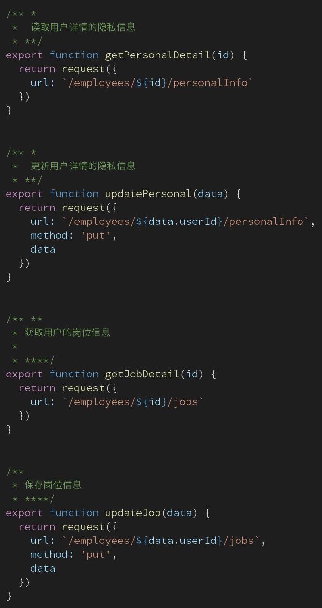

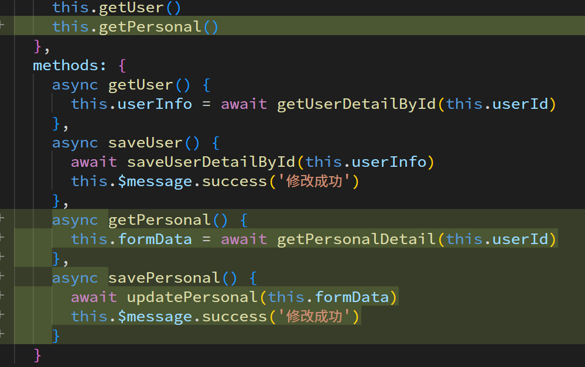

# 上传组件

## 本地交互

### 显示上传组件

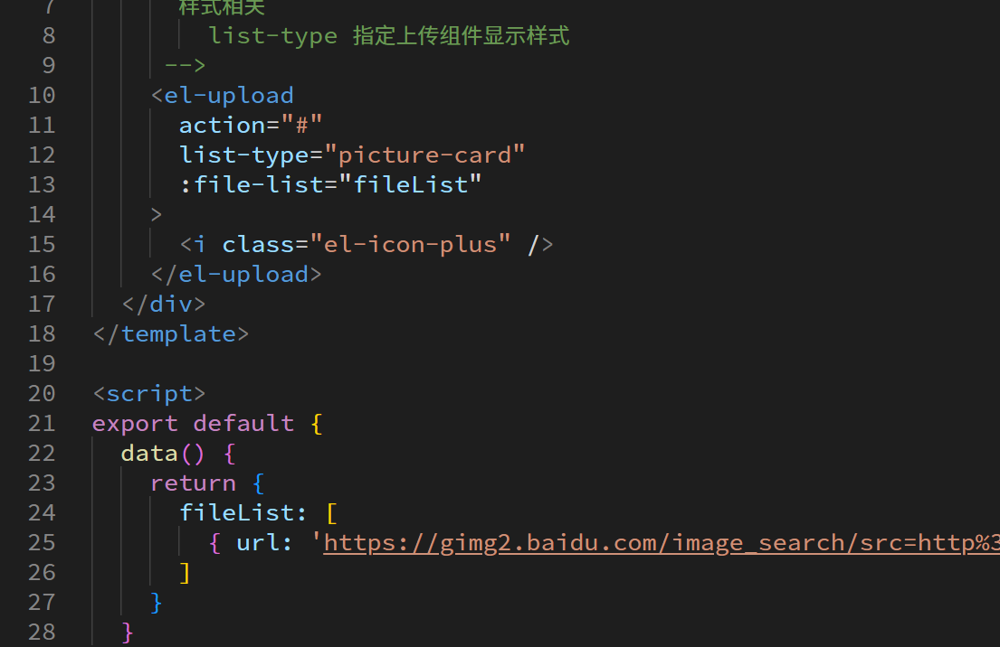

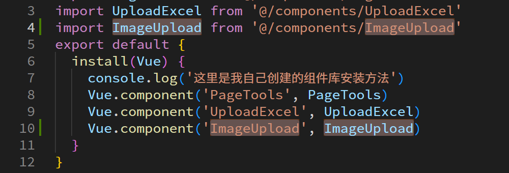

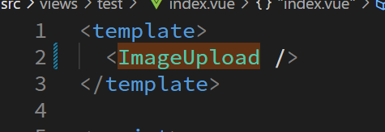

### 图片数量控制上传按钮

根据当前数组长度给上传组件设定动态css类名, 根据这个类名编写 css

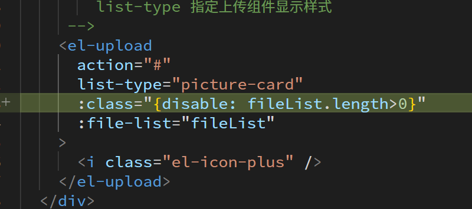

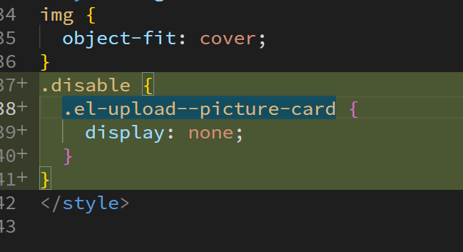

### 删除图片

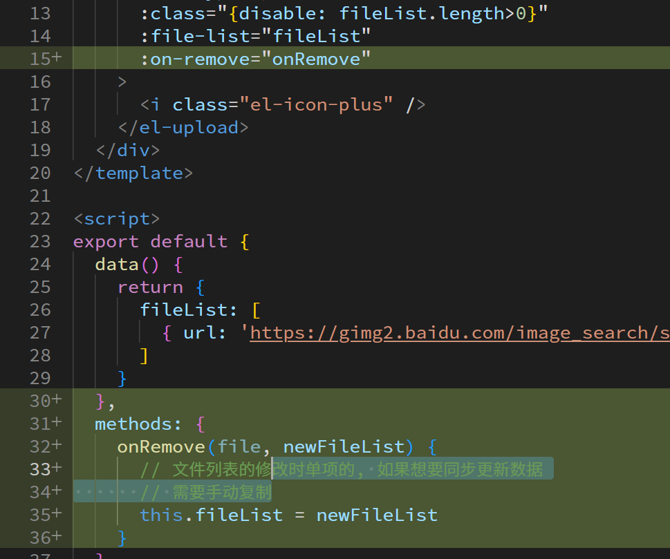

### 添加图片功能(还没有上传)

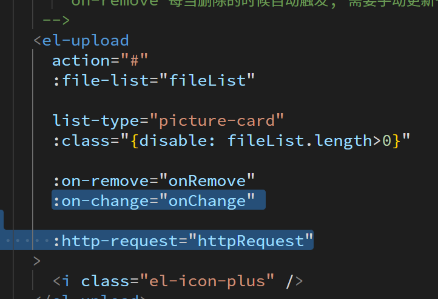

## 对接腾讯云

### 上传前的校验

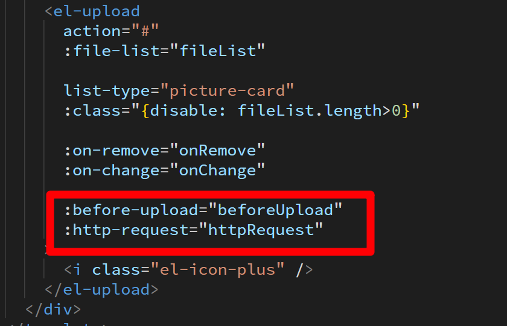

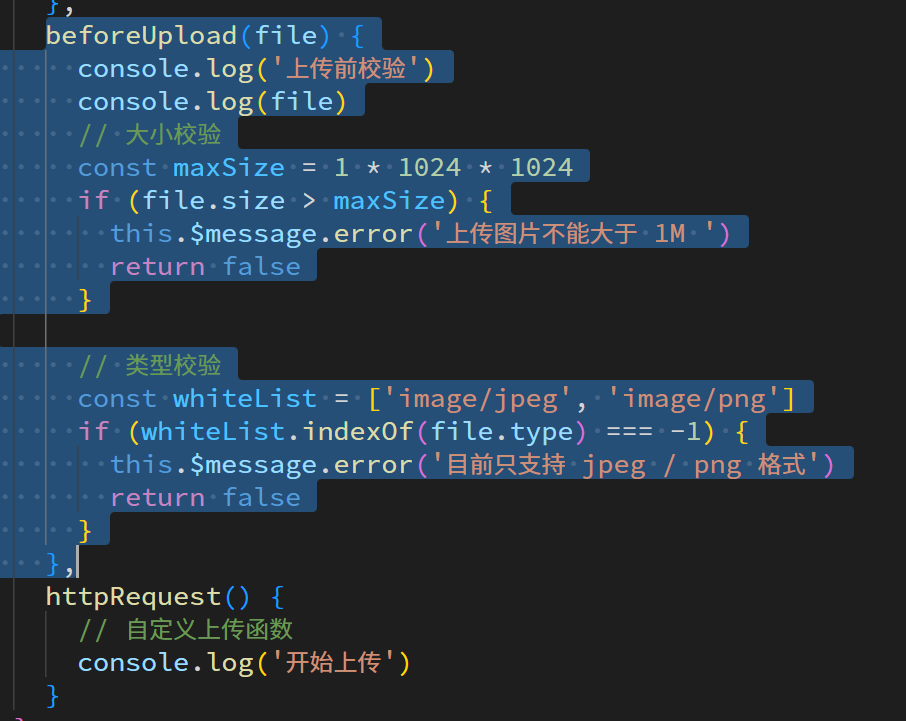

### 真正的上传

腾讯云为了自己的生意, 将上传功能封装成了工具库, 只需要按照腾讯说明, 使用封装的库即可

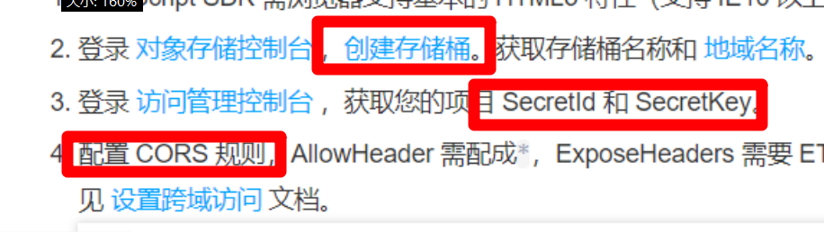

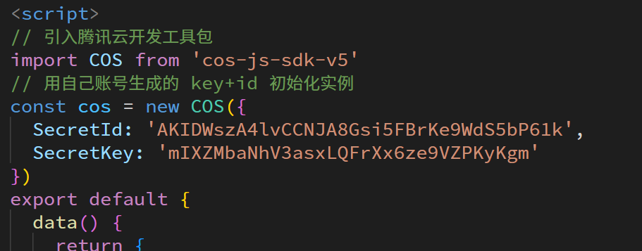

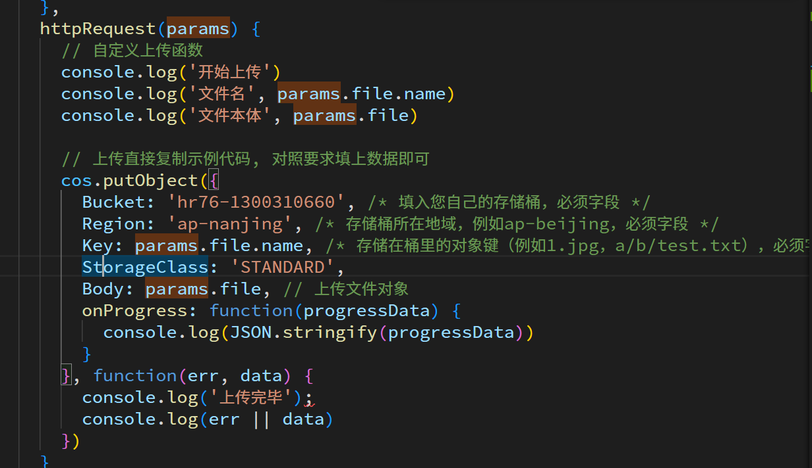

## 上传后后续处理

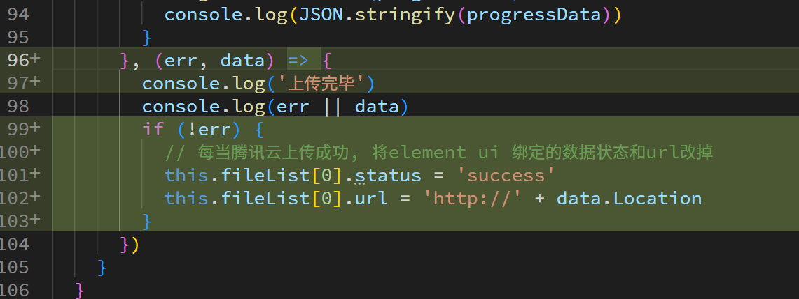

# 实际使用上传组件

## 将组件显示在页面上

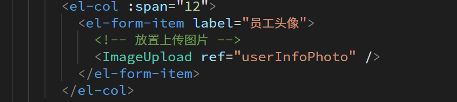

## 回显数据

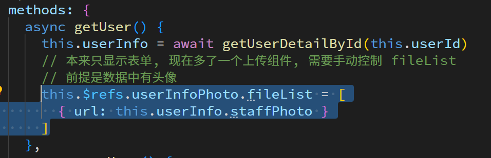

## 确定发请求

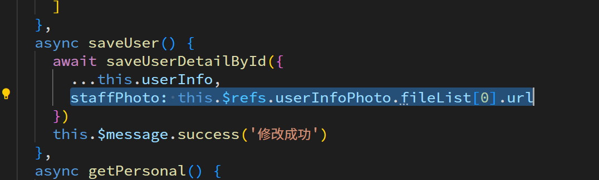
