# 首页

## 布局

直接复制讲义中的架构即可

## 日历

### 基本布局

创建日历组件, 其中功能自己写, 样式可以复制

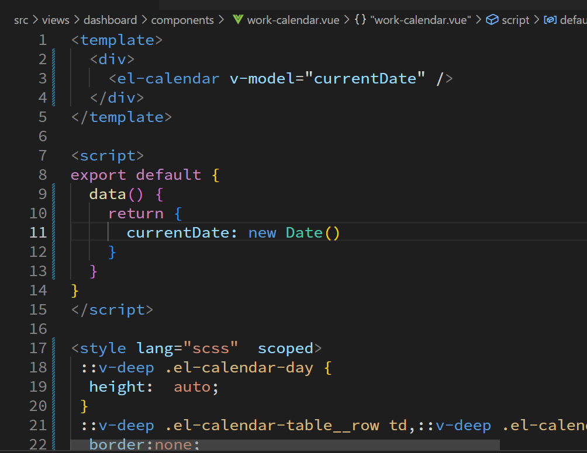

### 显示下拉菜单

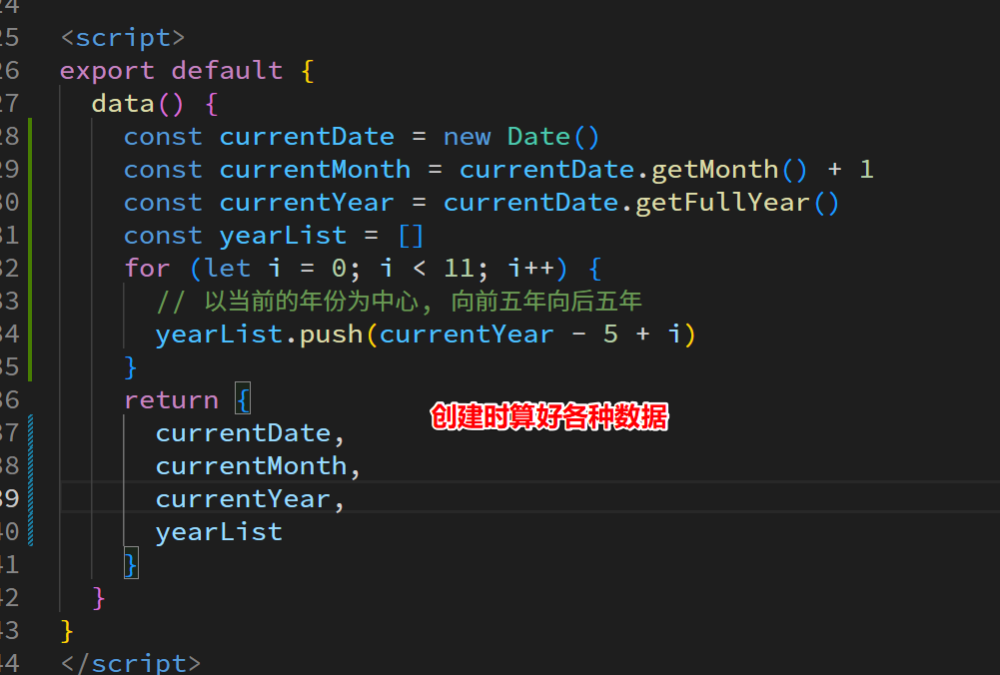

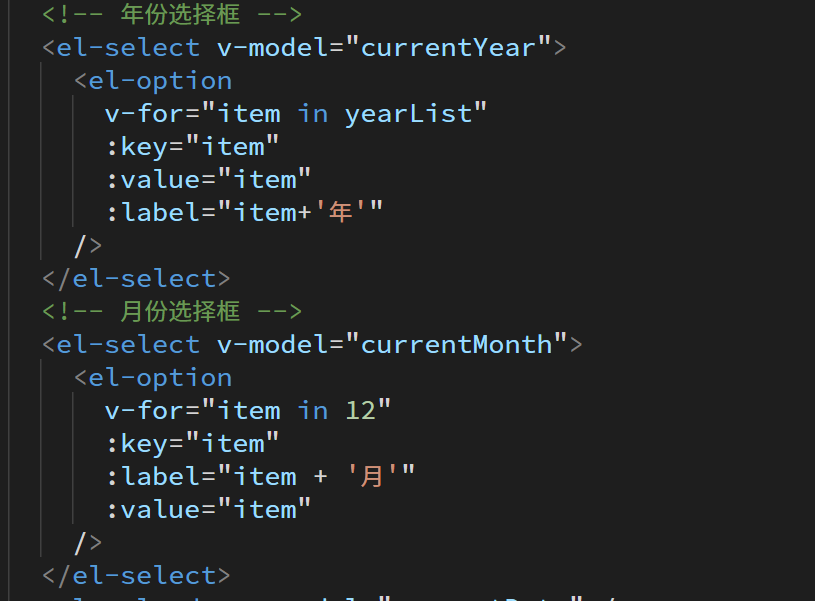

### 控制日历日期转变


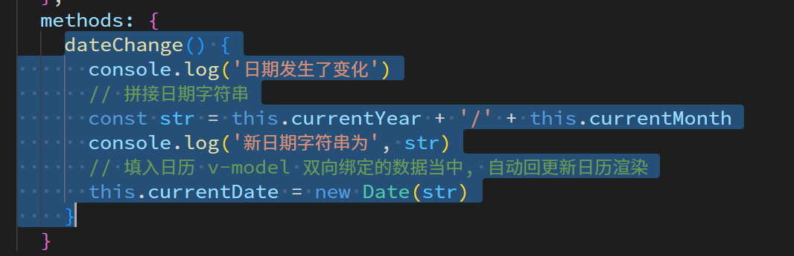

### 自定义样式

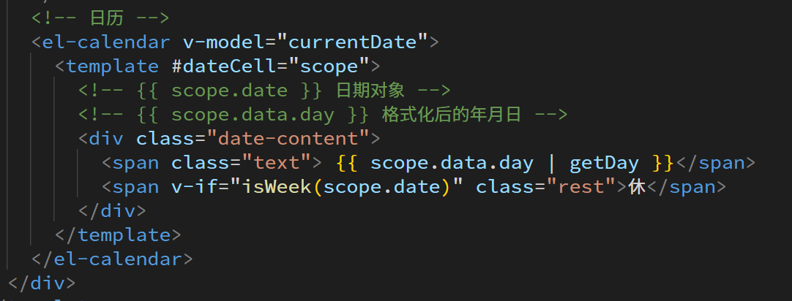

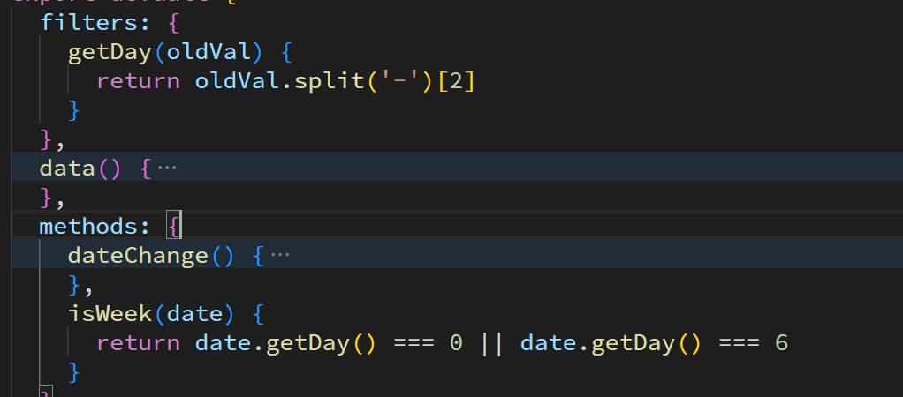

## 雷达图 echarts 在项目中的使用方式

[Apache ECharts](https://echarts.apache.org/zh/index.html)

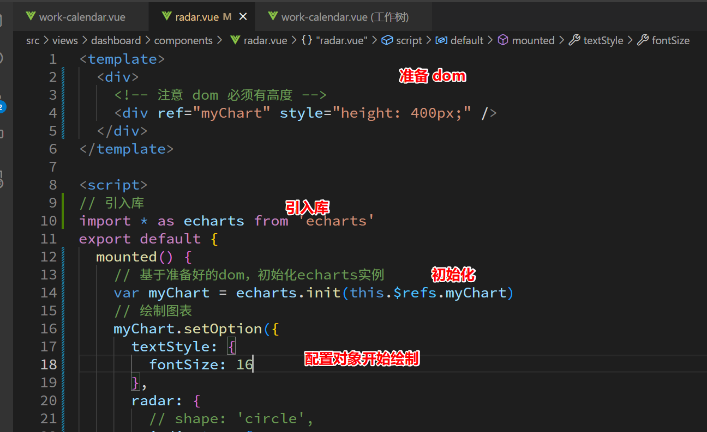

# 其他插件

## 全屏

安装时注意添加 vue.configjs 配置


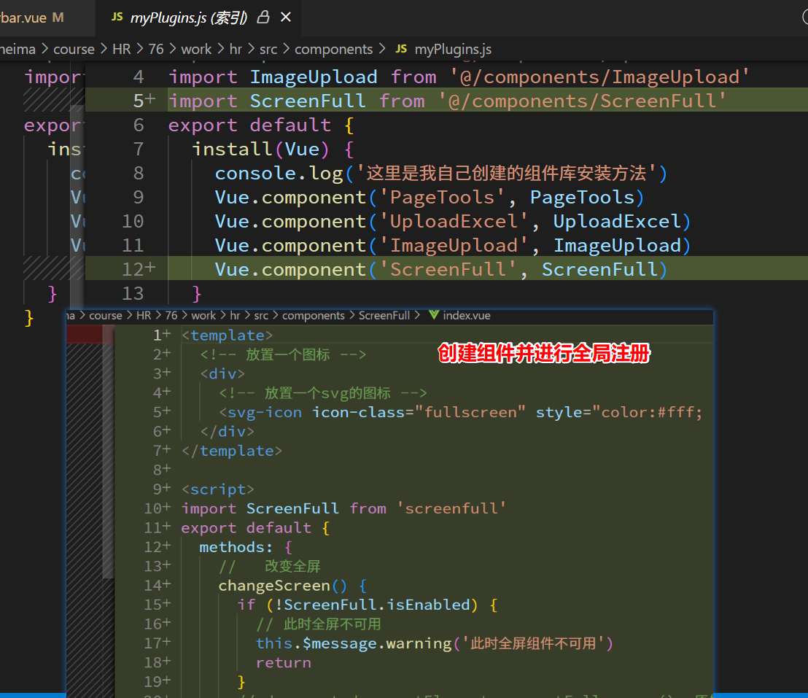

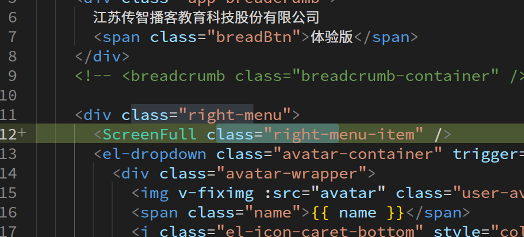

## 切换主题色

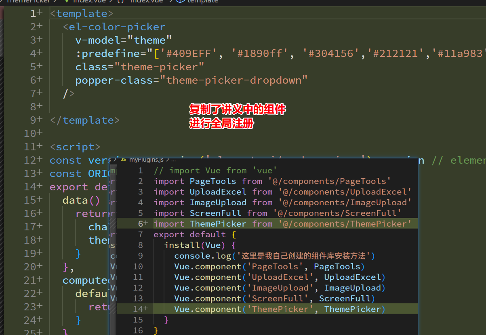

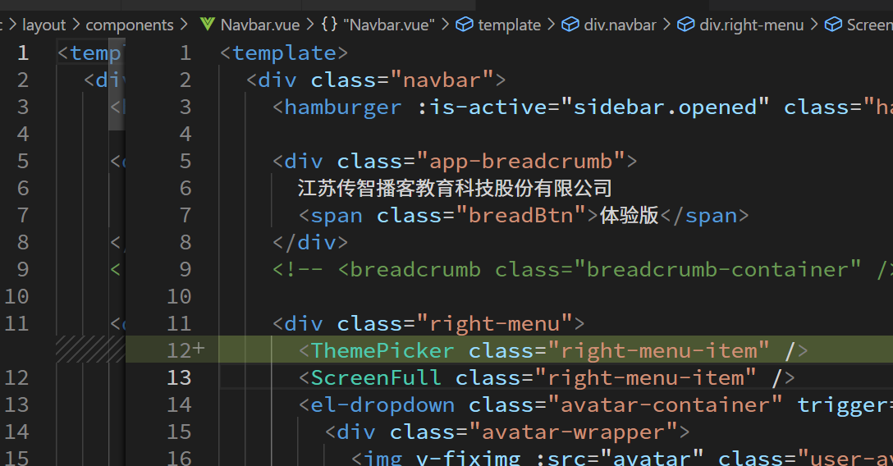

# 国际化

## 准备插件

```bash
npm i vue-i18n@8
```

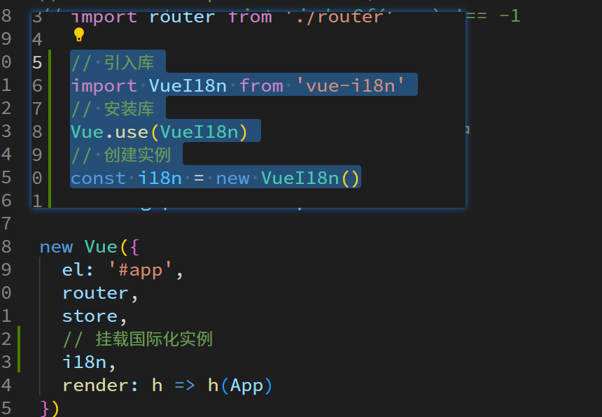

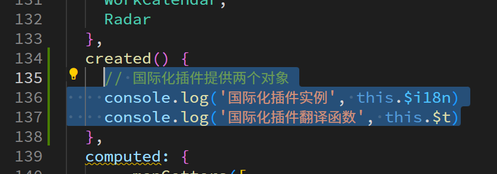

## 基本使用

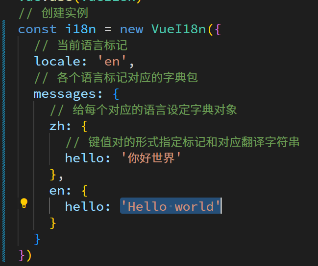

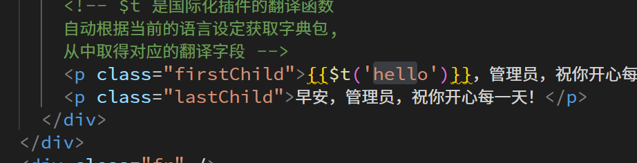

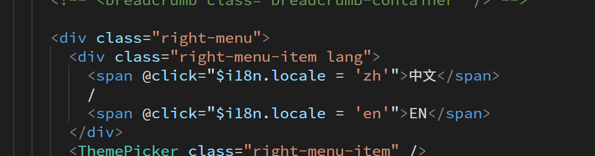

## element ui 国际化使用

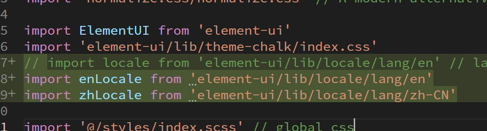


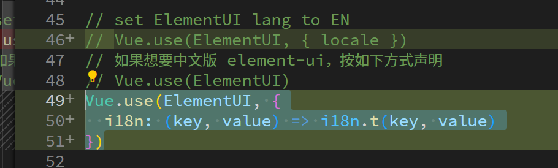

# 打包优化

## 检测

```bash
npm run build:prod -- --report
```

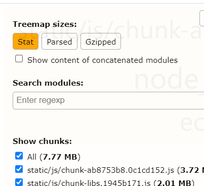

## 按需加载

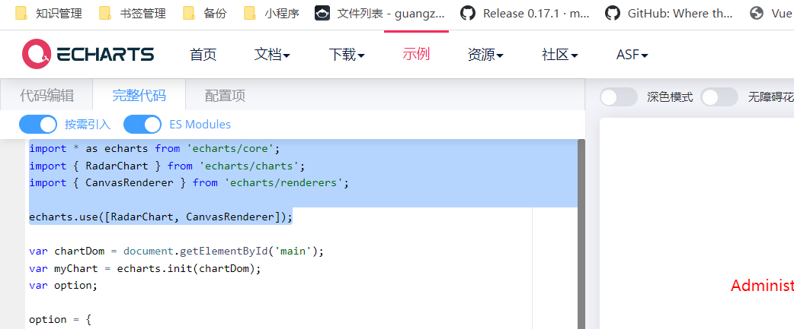

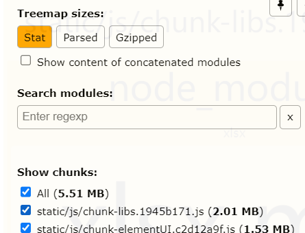

## CDN优化

### 在本地打包时, 排除第三方库

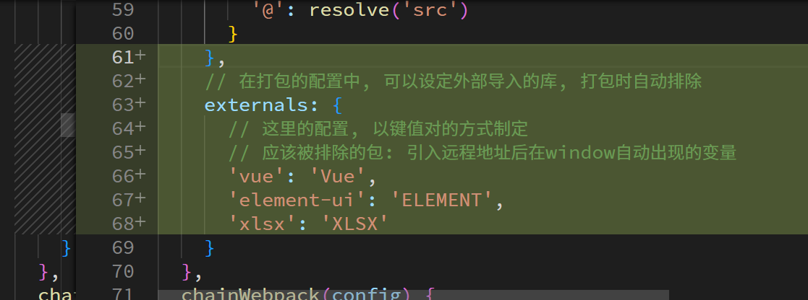

### 教会用户从远程加载

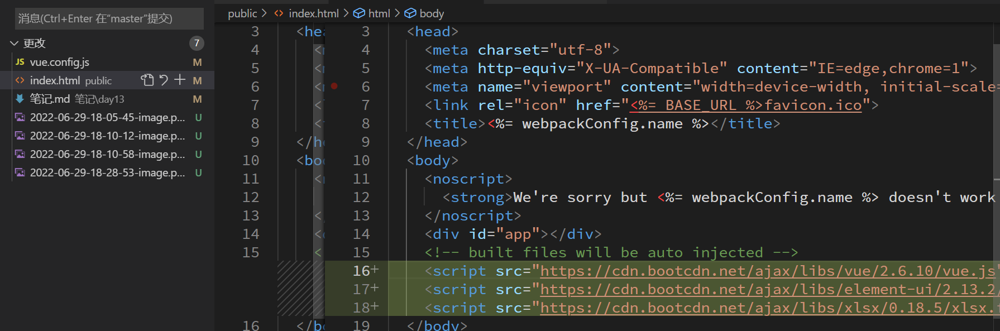

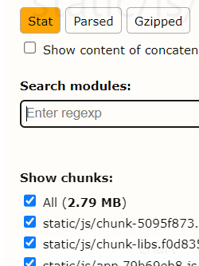
