# 示例代码清理

## 模拟登陆数据

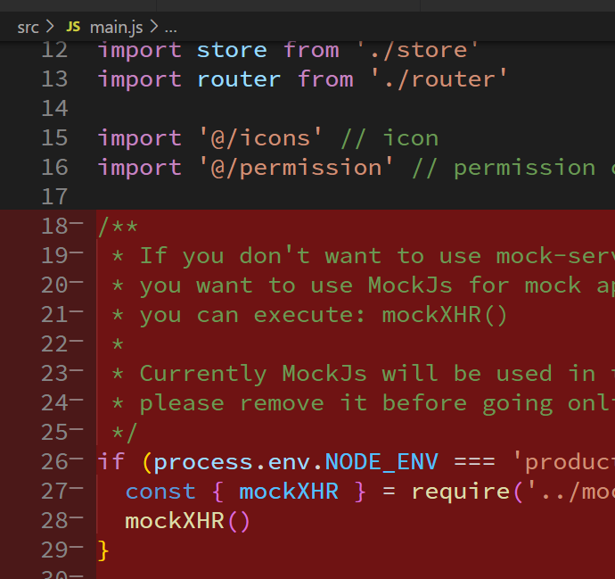

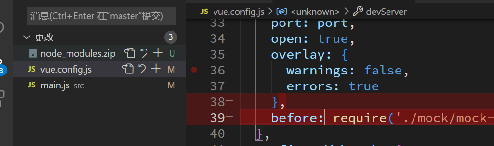

## 导航守卫

`@/permission.js`

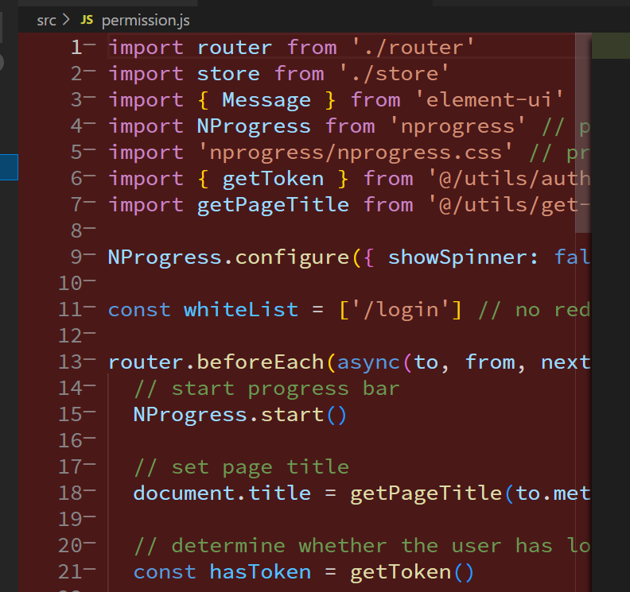

## vuex 用户模块清理

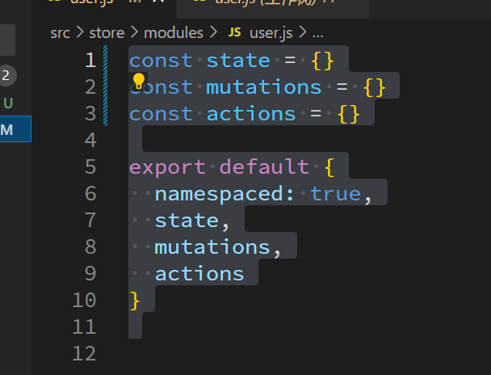

# 关联远程仓库

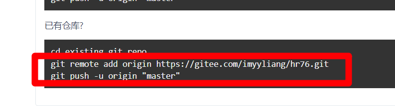

```bash
git remote rm origin
git remote add origin 地址
git push -u origin master
```

# eslint 配置

```json
    "eslint.run": "onType",
    "eslint.options": {
        "extensions": [
            ".js",
            ".vue",
            ".jsx",
            ".tsx"
        ]
    },
    "editor.codeActionsOnSave": {
        "source.fixAll.eslint": true
    }
```

# 公共样式和图片导入

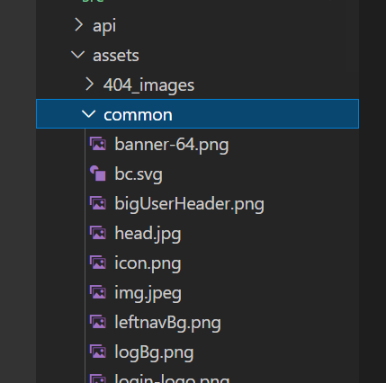

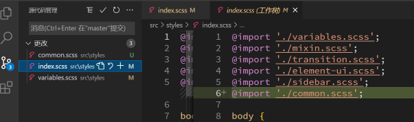

# 网站端口和网站名称的修改

## 环境变量的概念

这个功能是脚手架 vue cli 默认提供

在代码里面可以通过 process.env.字段名 固定写法获取环境变量

脚手架会根据你当前运行的命令到不同的文件获取,

npm run dev => .env.development

npm run build => .env.production

## 端口

基于 vue.config.js 里面的内容, 发现获取环境变量中的 port 属性于是可以自定义

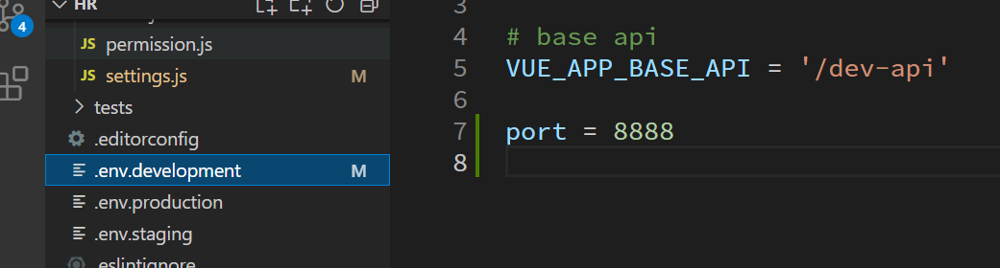

## 名字

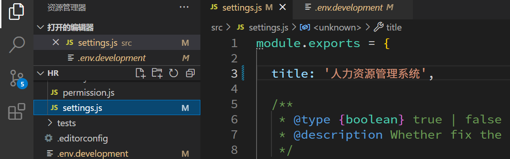

# 表单验证说明

## 简单表单创建

```html
    <el-form>
      <el-form-item label="手机号">
        <el-input v-model="formData.mobile" />
      </el-form-item>
      <el-form-item label="密码">
        <el-input v-model="formData.password" />
      </el-form-item>
      <el-form-item>
        <el-button>登录</el-button>
      </el-form-item>
    </el-form>
```

## 表单校验的属性

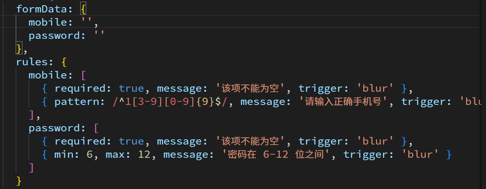

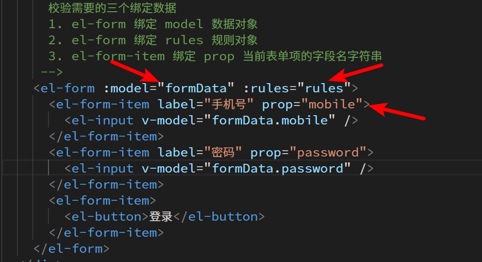

## 自定义校验方式

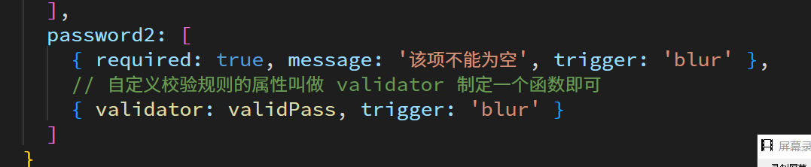

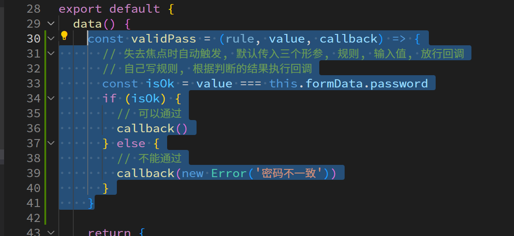

## 全表单校验的方法

```js
    async login() {
      // 全表单校验方法一, 加入回调函数即可, 所有的后续操作都在校验成功后再执行
      // this.$refs.loginForm.validate(isOk => {
      //   if (isOk) {
      //     console.log('登陆成功')
      //   } else {
      //     console.log('校验失败')
      //   }
      // })
      // 全表单校验方法二, promise 的用法(因为element ui提供两种封装)
      // this.$refs.loginForm.validate().then(() => {
      //   console.log('登录成功')
      // }).catch(() => {
      //   console.log('校验失败')
      // })
      // 其实 promise 最大功能就是等待前面的操作执行成功, 再继续执行 .then里面的操作
      // async / await 的语法也能实现
      // 全表单校验方法三, 依旧是 promise 不过用 async / await 的语法来写
      try {
        await this.$refs.loginForm.validate()
        console.log('登陆成功')
      } catch (error) {
        console.log('校验失败', error)
      }
    }
```

# 登录页样式布局调整

复制粘贴讲义代码即可

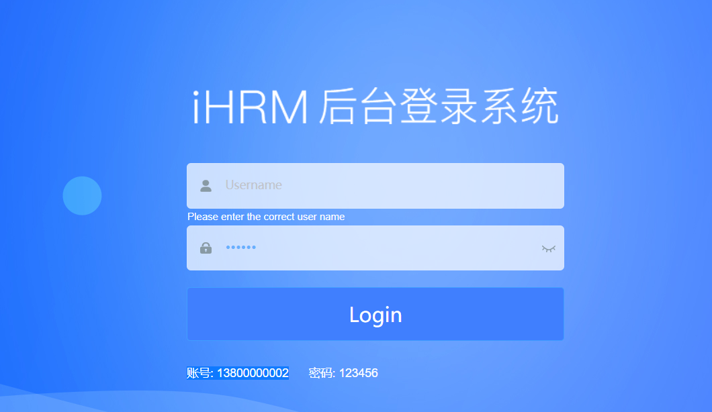
