# 清理请求封装的拦截器部分

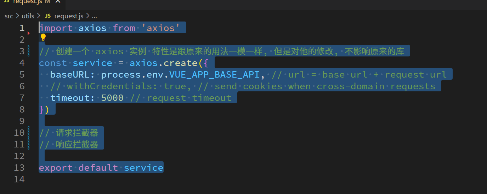

# 登录请求

## 封装api

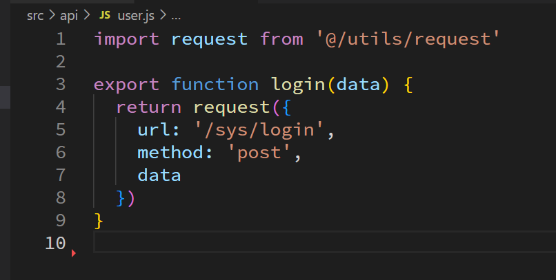

## 设置基准路径

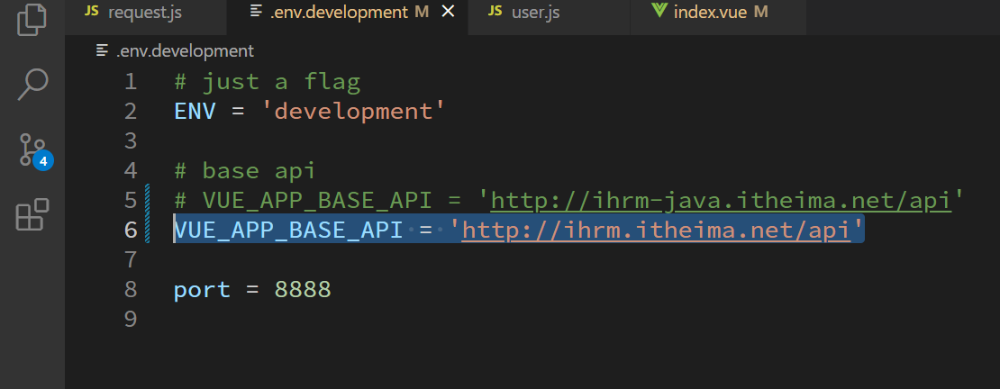

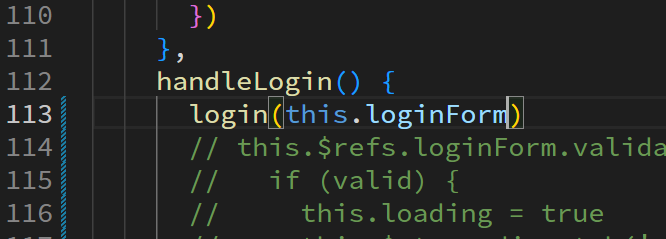

# 代理解决跨域问题

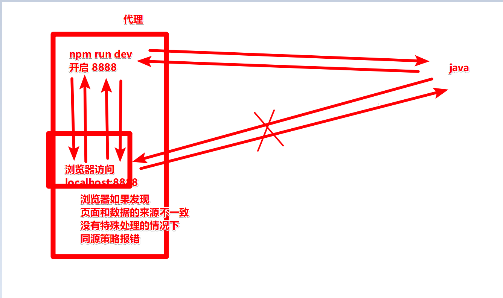

## 将请求发到本地页面服务8888

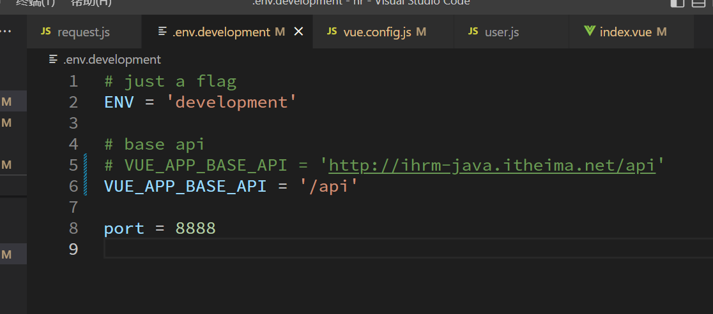

## 教会8888代理数据

`vue.config.js`里面的 devServer 配置

```js
    // 代理配置叫 proxy 对象
    proxy: {
      // 键值对的形式, 指定应该转发的url模式:转发的目的地
      '/api': {
        target: 'http://ihrm-java.itheima.net',
        changeOrigin: true
      }
    },
```

# 完善登录的流程

## 修改花裤衩的登录数据

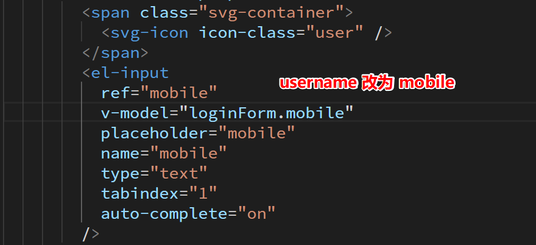

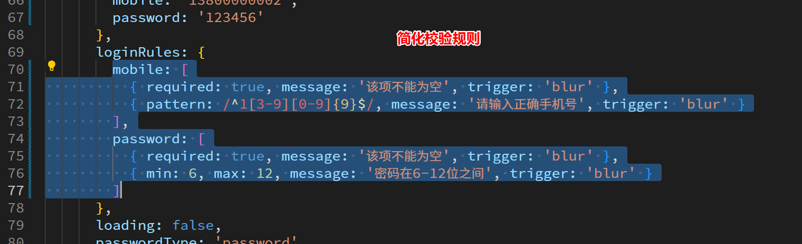

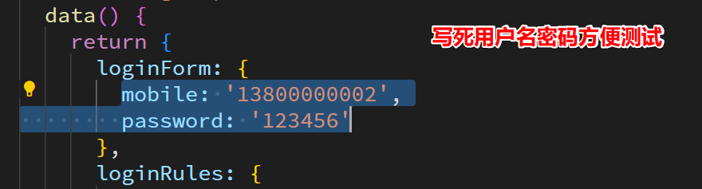

## 整理登录用户体验

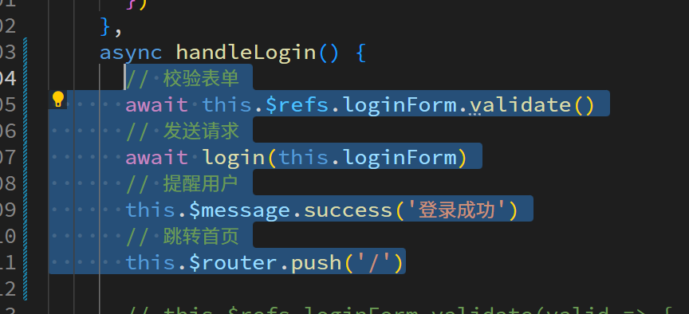

# 将登录流程封装到 vuex 里面

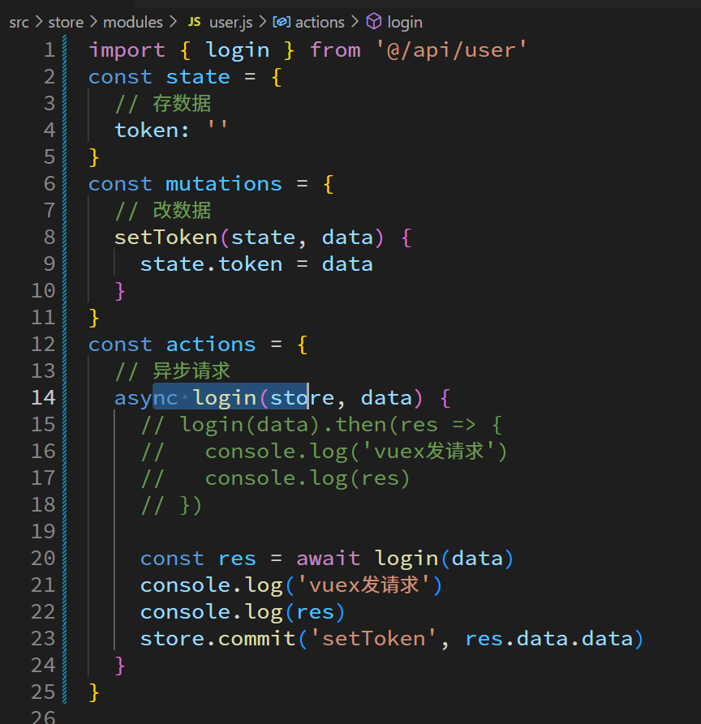

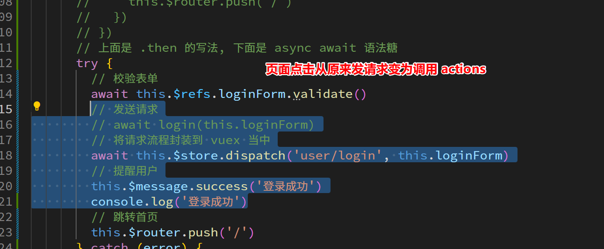

# 数据持久化(二选一)

## localStorage

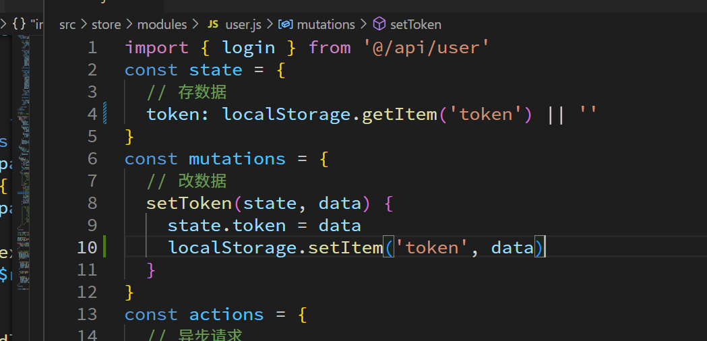

## cookie

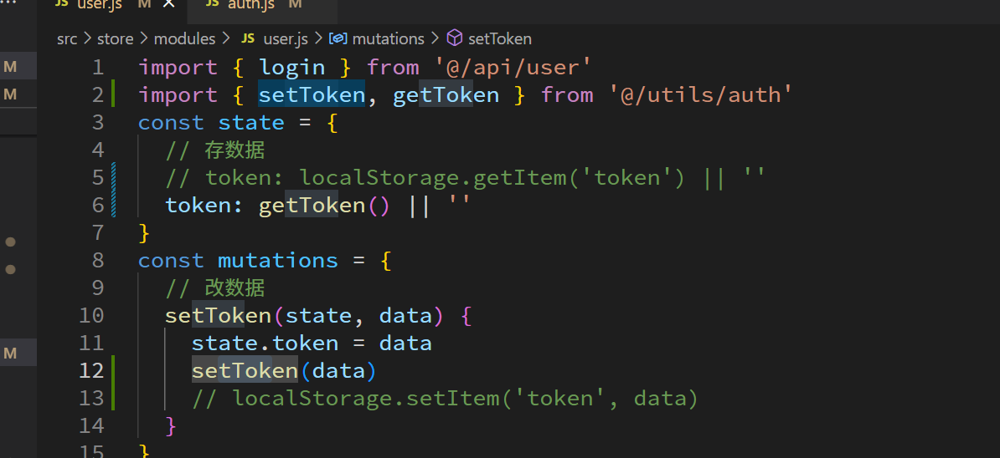

# 响应拦截器

## 成功情况的处理

因为 axios 的响应数据多嵌套了一层 data, 为了之后开发方便, 在响应拦截时直接解开, 外面直接接受 res.data.data 使用即可

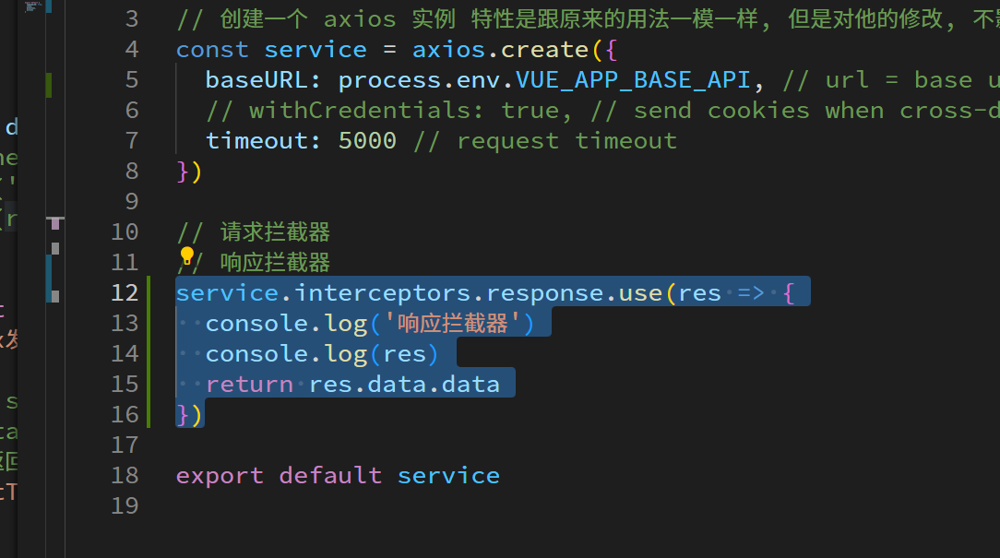

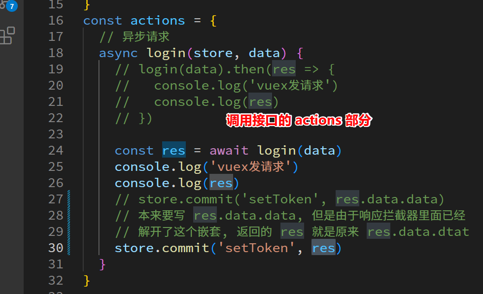

## 两种错误情况

错误分两种, 一种是请求正常, 只是后端说数据不对, 响应码还是 200

另一种是硬性错误, 直接连响应都不正常 200 以外

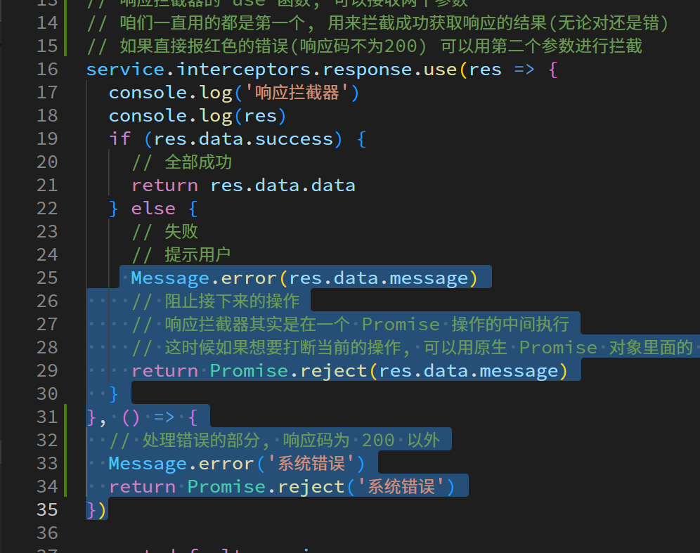

# Token 的导航守卫拦截

```/src/permission.js`

```js
import router from '@/router'
import store from '@/store'

router.beforeEach((to, from, next) => {
  // 根据用户有登陆还是没有登录进行访问控制
  console.log('导航守卫', store.getters.token)
  console.log(to)
  if (store.getters.token) {
    // 登陆了, 本来直接放行就行, 但是我们的项目要求如果已经登陆过,不能重复再次登录
    if (to.path === '/login') {
      // 1.1. 已登录去登录页 => 跳首页
      // next() 如果不加任何参数, 就是直接放行, 如果加上新的路径, 就是跳转页面
      next('/')
    } else {
      // 1.2. 已登录,去其他正常页面 => 放行
      // 其他非登录页直接放行
      next()
    }
  } else {
    // 未登录
    // next(路径)其实是跳转页面, 跳转过后再次执行导航守卫
    // next('/login') 不能只放这个, 因为每次跳转都会重新出发导航守卫
    // 于是死循环 没token => 跳 login => 没token => 跳 login => 没token => 跳 login
    // if (to.path === '/login' || to.path === '/404' || to.path === '/test') {
    // 上面写法太烦人, 用白名单即可
    const whiteList = ['/login', '/404', '/test']
    if (whiteList.indexOf(to.path) > -1) {
      // 2.1. 未登录 目的地在白名单 => 放行
      // 如果存在于可以随便进入的白名单, 放行
      next()
    } else {
      // 2.2. 未登录 目的地不再白名单 => 登录页
      // 如果不是可以随便进入的白名单, 跳转到登录页
      next('/login')
    }
  }
})
```

# 首页左侧布局和样式

直接复制粘贴完事
