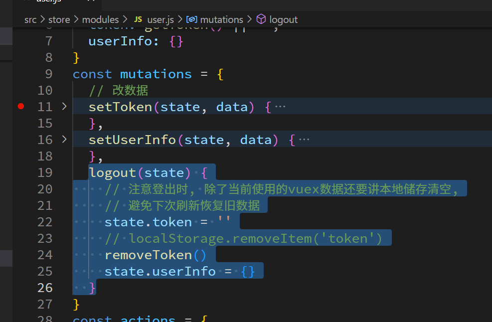
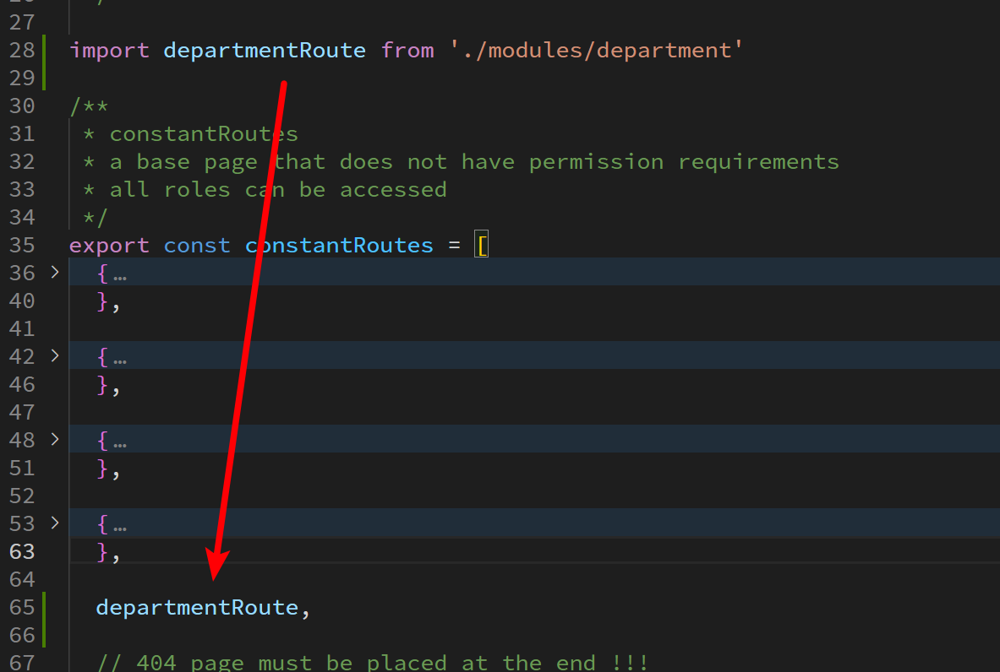

# 用户数据的获取和渲染

## 尝试获取

## 封装在 vuex 里面

## 追加员工详情数据

因为需要渲染头像, 原来的接口数据不够,追加一个

虽然改完有可能图片报错, 但是只要 src 数据对上了即可, 

图片问题后面解决

# 自定义指令修复图片错误

## 自定义指令创建

## 图片修复

基本就是在自定义指令中, 如果发现问题, 就替换 src

# 登出功能

# token 失效的介入

## 被动

## 主动

主要逻辑是, 每次发请求带 token 的时候, 检查跟上次发请求之间的间隔, 如果超过一定时间, 就直接退出

# 路由页面准备

## 清理

## 当前项目中创建页面的基本操作

## 大量图标复制

## 页面 vue 文件创建

## 创建路由配置并引入使用

