# 公司与角色设置

## 布局

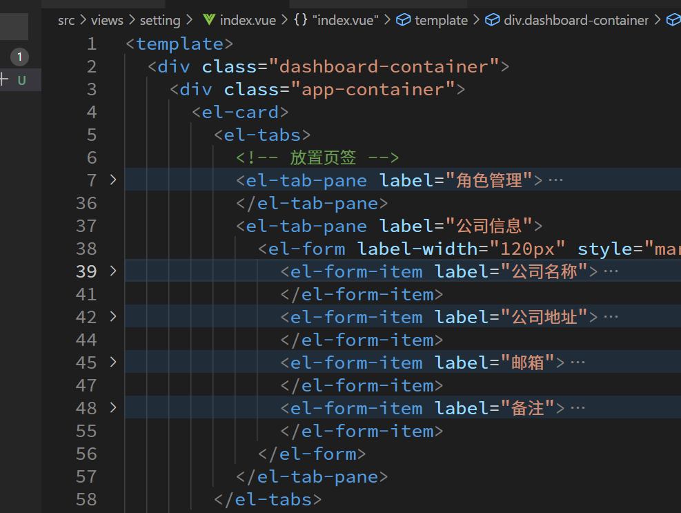

## 渲染公司信息

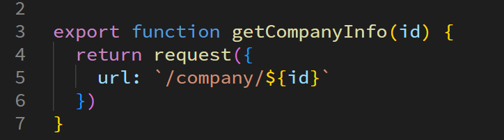

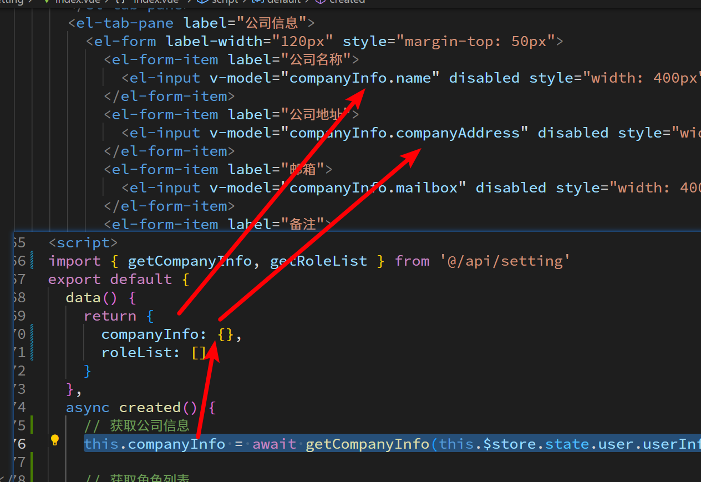

## 渲染角色列表

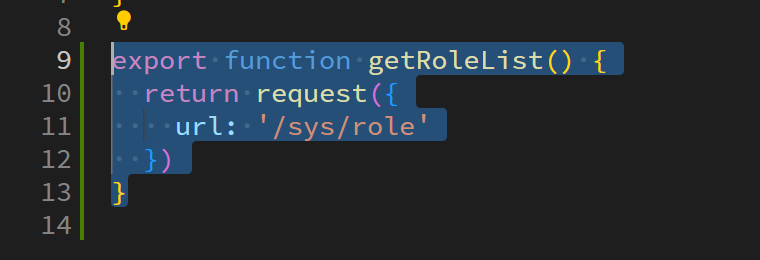

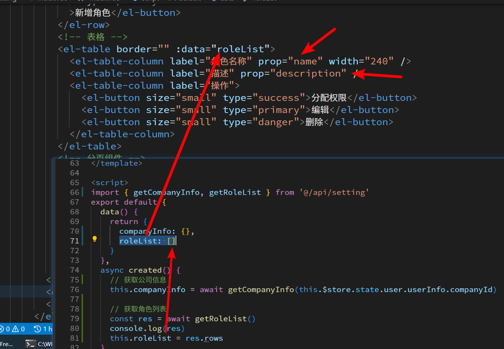

## 分页

请求参数

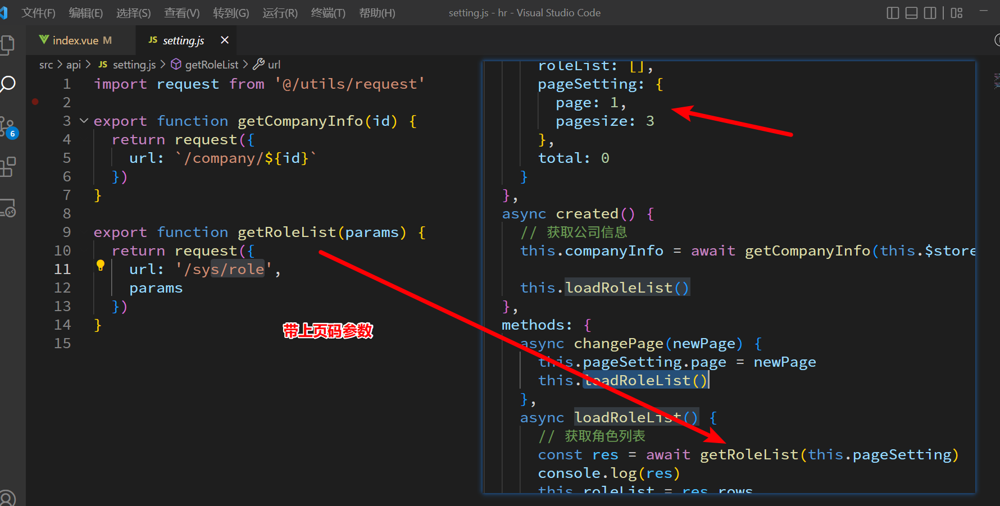

显示分页页码

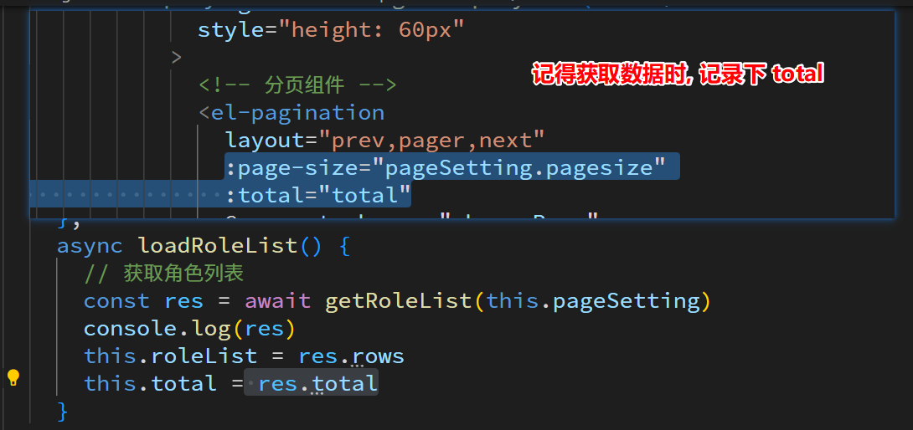

么当点击不同页码需要监听事件重发请求

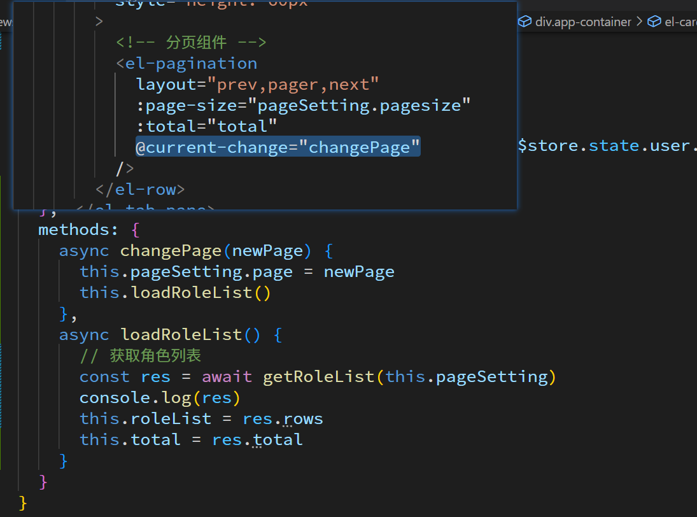

# 新增角色

## 弹窗

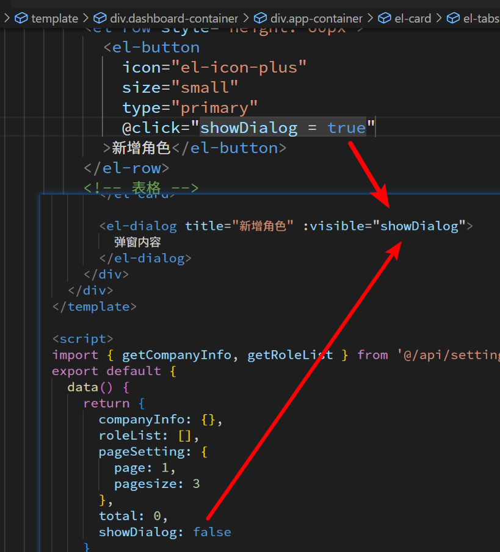

## 表单数据

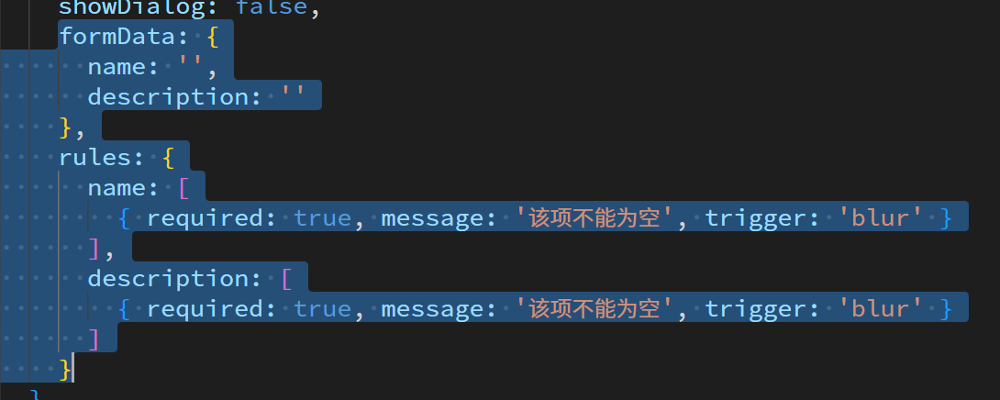

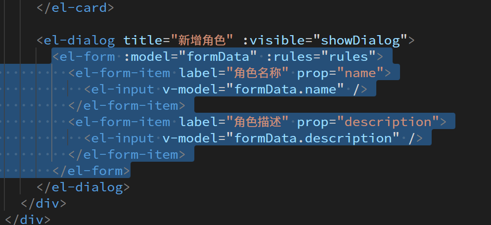

## 新增成功

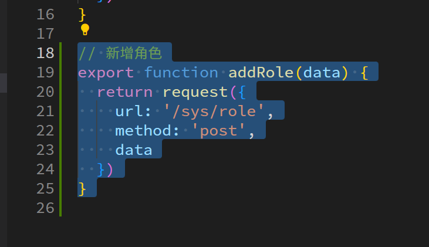

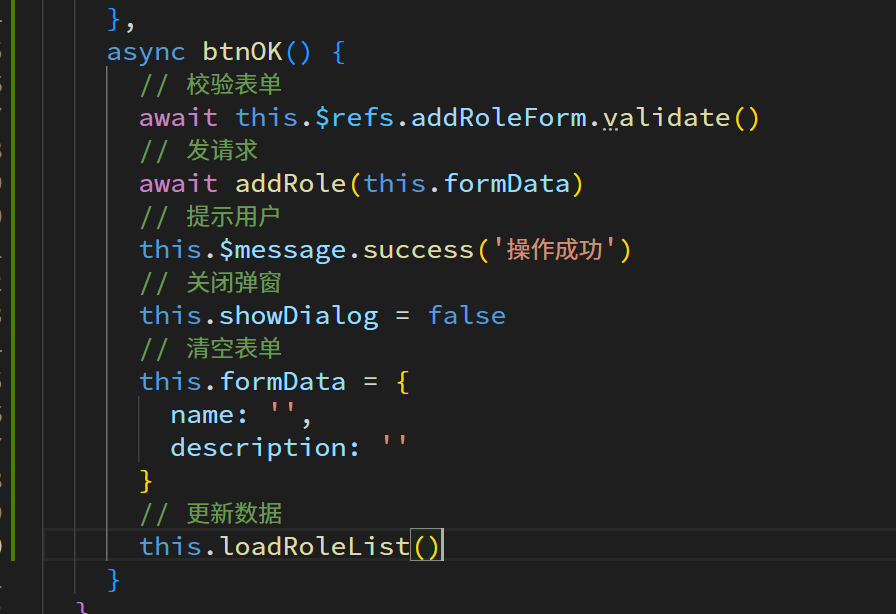

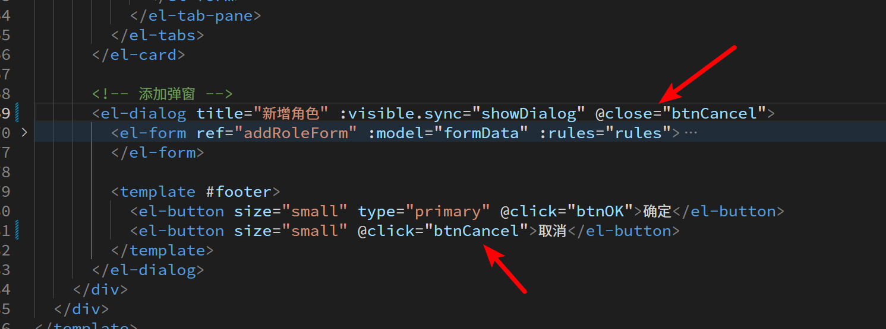

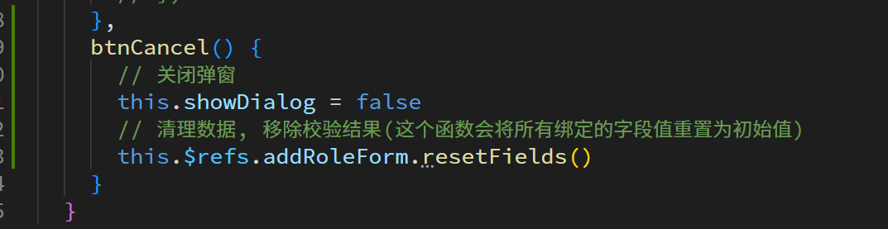

# 编辑角色

## 弹窗

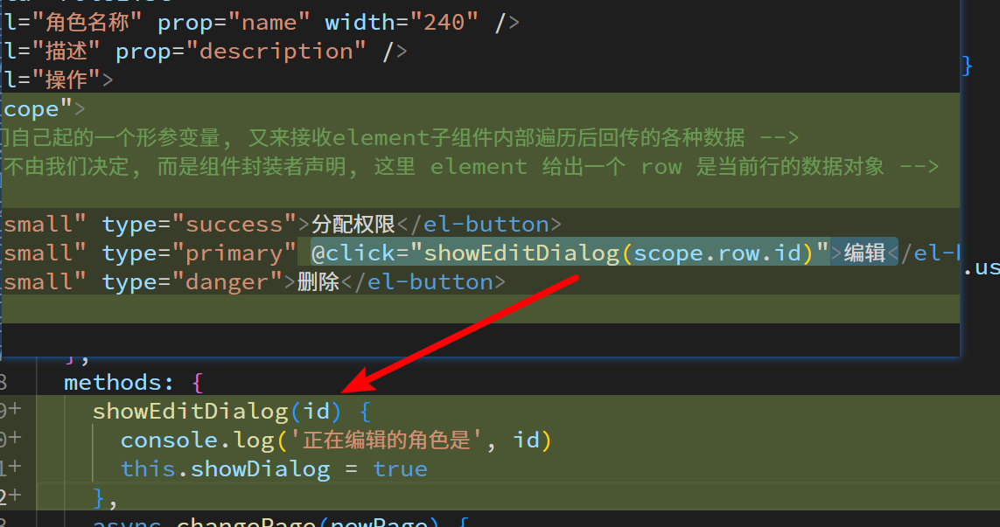

## 数据回显

注意数据回显是会在后端获取详情

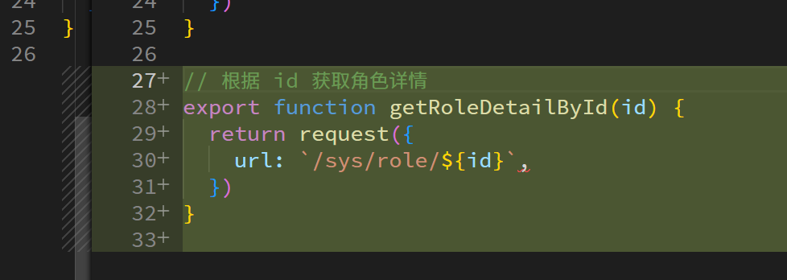

## 编辑成功

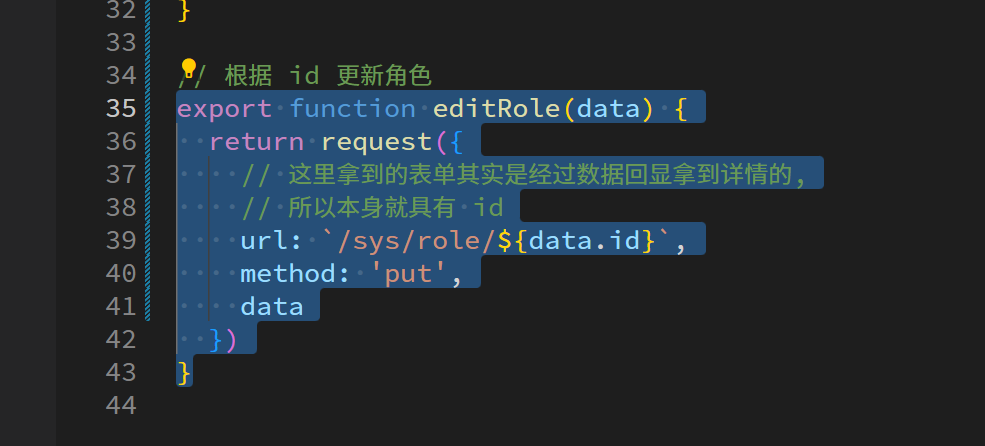

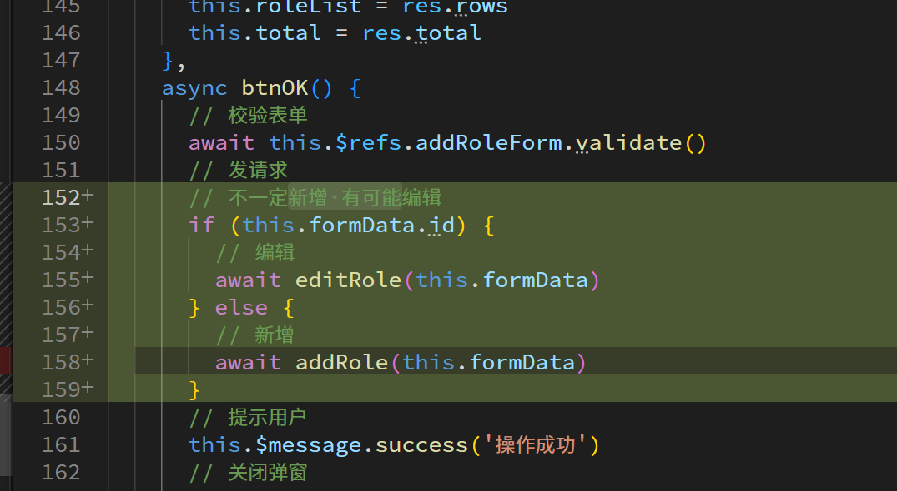

小小的坑, 表单重置数据的函数只能重置绑定的默认值, 如果想完全清空需要手动处理

# 删除

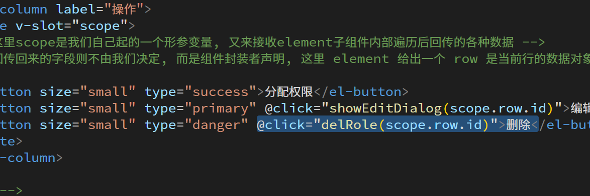

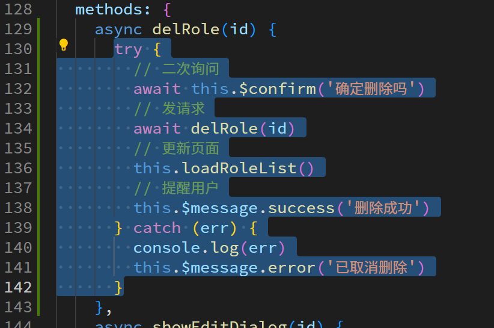

# 组织架构页面(部门)

## 顶部公司信息布局

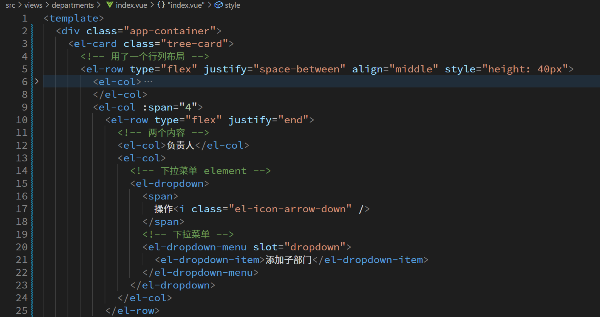
