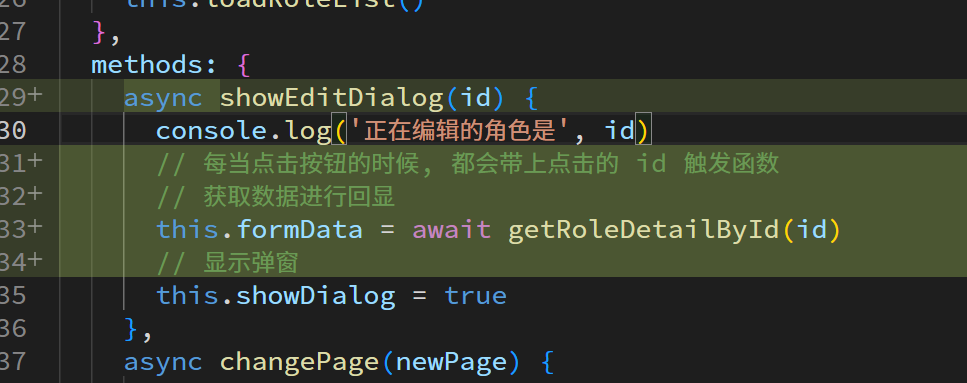
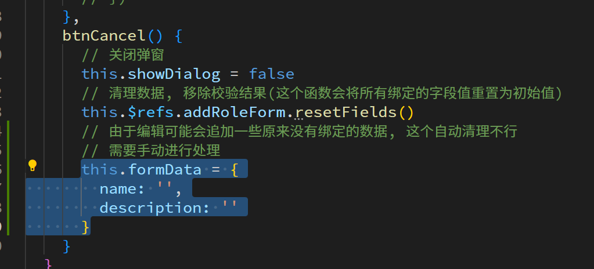

# 公司与角色设置

## 布局

## 渲染公司信息

## 渲染角色列表

## 分页

请求参数

显示分页页码

么当点击不同页码需要监听事件重发请求

# 新增角色

## 弹窗

## 表单数据

## 新增成功

# 编辑角色

## 弹窗

## 数据回显

注意数据回显是会在后端获取详情

## 编辑成功

小小的坑, 表单重置数据的函数只能重置绑定的默认值, 如果想完全清空需要手动处理

# 删除

# 组织架构页面(部门)

## 顶部公司信息布局

