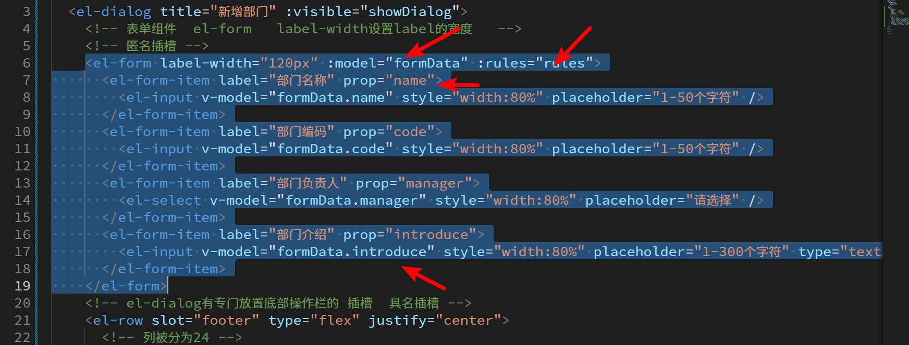

# 部门页面静态布局

## 树形默认使用

## 作用域插槽自定义

## 组件封装

# 部门数据获取和渲染

## 获取后端接口数据

## 数据转换

如果后端给出的数据刚好跟 element ui 要求一致, 当然一切正常,但是现在api返回的数据不是以 children 作为嵌套, 而是 每一个部门都有一个 pid 指向自己的上一级, 其中最顶级的部门 pid === ''

我们需要自己来进行改造

基本逻辑是, 如果你给我一个表, 你给我一个 id 我可以遍历这个表, 哪些 部门的 pid === id 就是属于当前的子部门

# 新增

## 弹窗组件的创建和弹起

## 表单数据的绑定和校验

## 处理负责人的下拉列表

需要向后端获取员工列表供用户选择

## 初步新增实现

对于一个新增来说, 最本质的是将一堆数据传给api服务器

想要新增成功, 1. 先检查数据准备完了没有, 2. 发请求

### 点击部门新增时, 添加id

哪个部门被点击, 就要将自己的 id 往外传, 供弹窗在新增时用作 pid

## 请求真正发送

