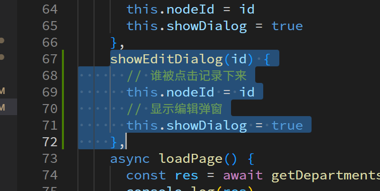
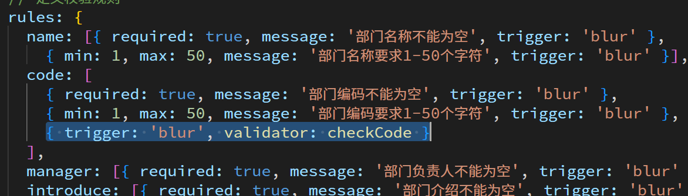
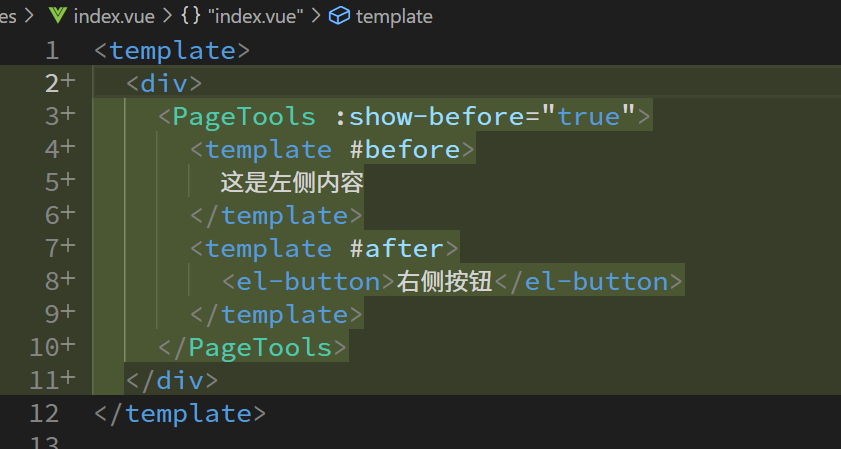
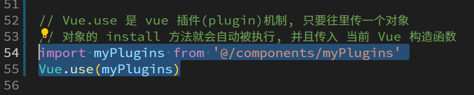

# 新增部门(续)

## 确定和取消按钮

# 编辑部门

## 复用新增弹窗

## 回显数据

## 确定发送请求

# 删除部门

# 额外校验逻辑

## code

整个公司内 code 必须唯一

## 部门名称

同一个父部门下, 不能有同名的两个部门

# 页面工具栏组件封装

## 使用插槽进行基本封装

## vue 组件库怎么进行大量组件注册

一般会将全局注册逻辑封装在一个 install 方法里面, 暴露对象, 使用者只需要引入这个对象, Vue.use 调用即可自动执行 install 方法一次大量注册组件

