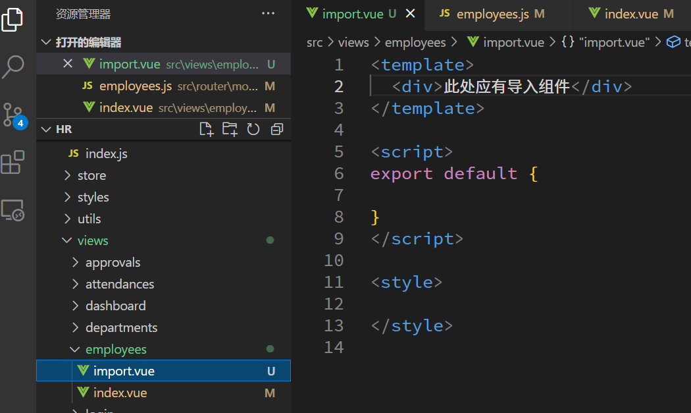

# 员工页面渲染

## 基本布局

## 数据渲染

## 分页

# 特定数据格式化

这里面可能有可以互相替代的写法, 但是故意用三种不同方式来处理

## 聘用形式

**格式化属性控制数据显示**

**枚举数据管理聘用形式**

## 入职时间

**过滤器基本用法**

**大量引入的注册方法**

## 账号状态

# 导入功能

## 页面和组件的准备

然后到花裤衩的页面复制上传组件, 注册使用起来

[src/components/UploadExcel/index.vue · 花裤衩/vue-element-admin - Gitee.com](https://gitee.com/panjiachen/vue-element-admin/blob/master/src/components/UploadExcel/index.vue#)

## 组件引入的 excel 数据

## 后端的批量添加接口

## 数据的转换

## 发送请求

