# 导出

## 获取所有员工数据

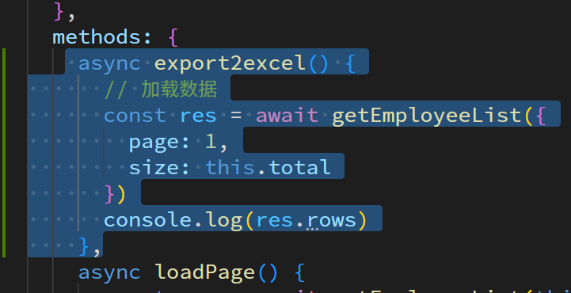

## 生成 excel

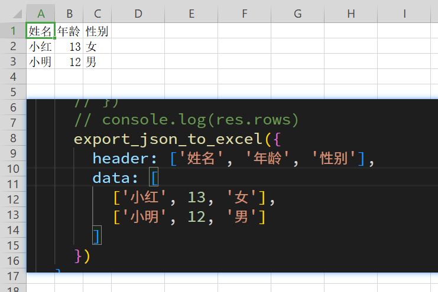

## 转换数据

后端给出的数据, 跟前端用到的数据结构不一致, 我们需要转换

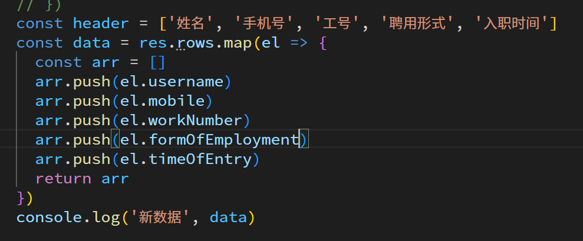

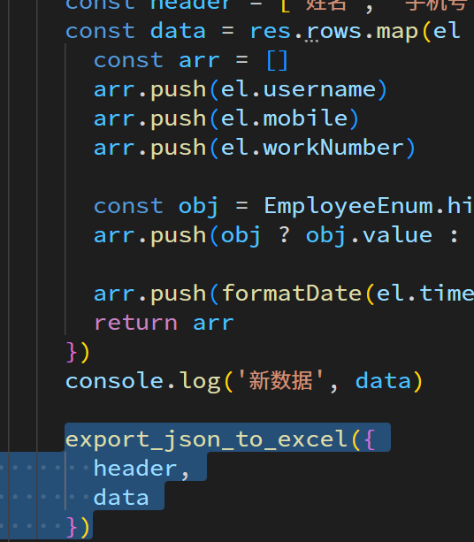

## 特殊数据处理

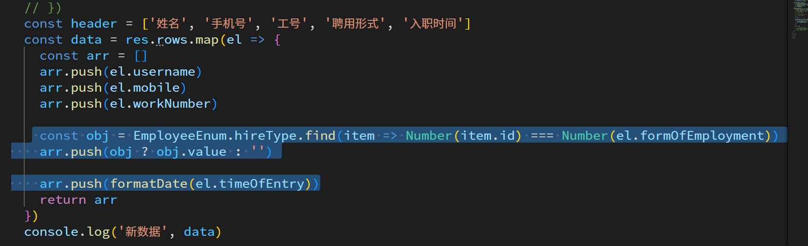

# 新增员工

## 准备表单数据和校验

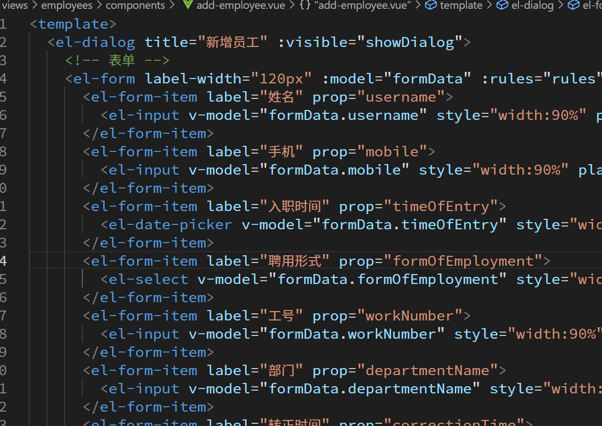

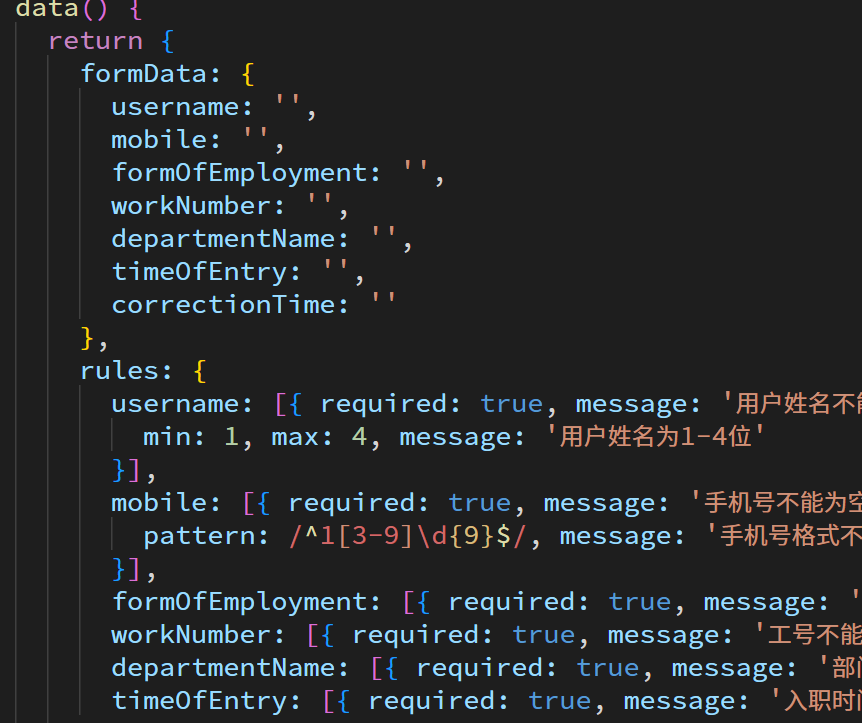

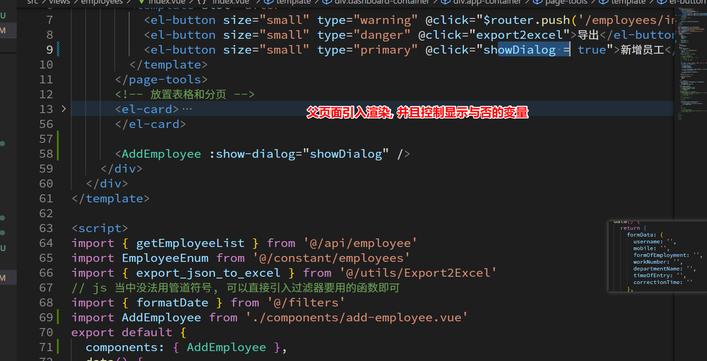

## 特殊数据处理

### 聘用形式

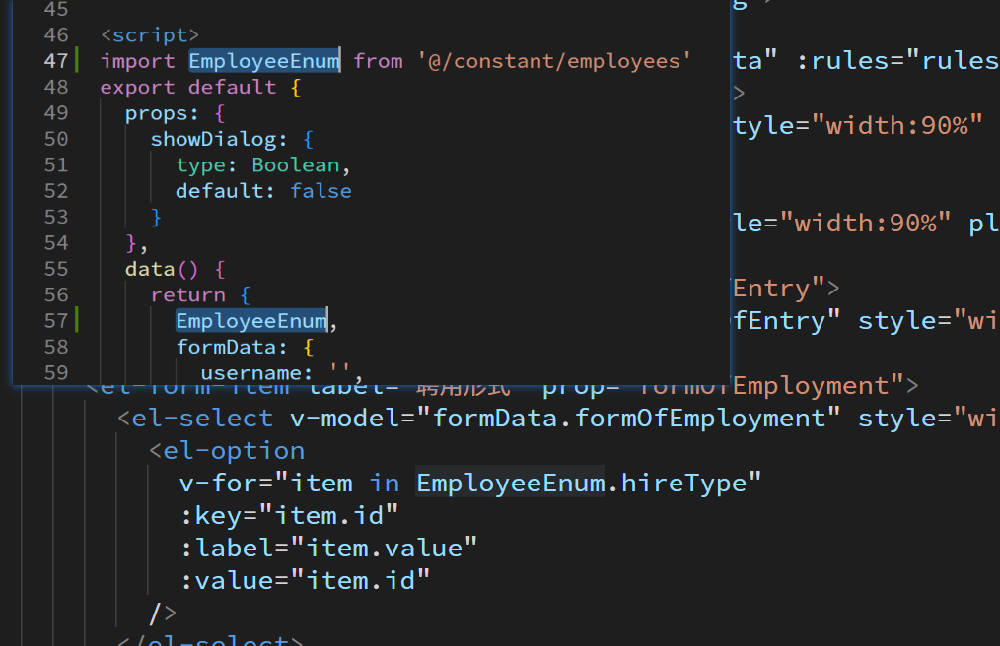

### 部门数据

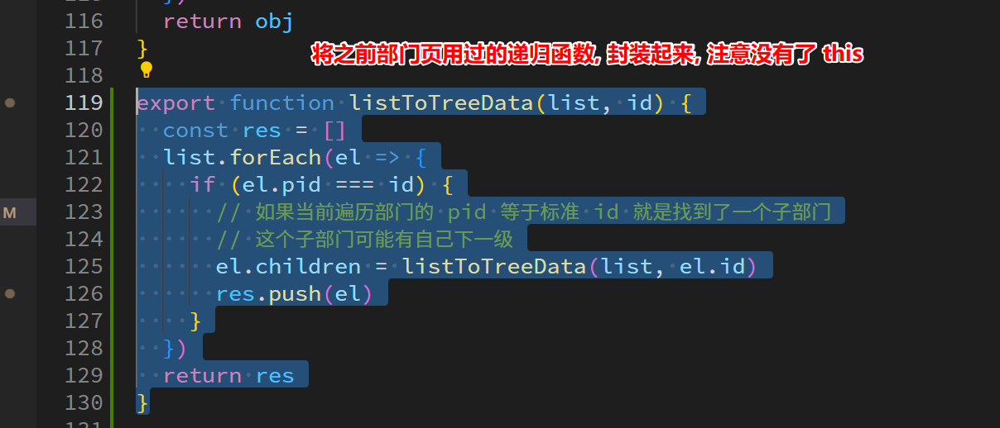

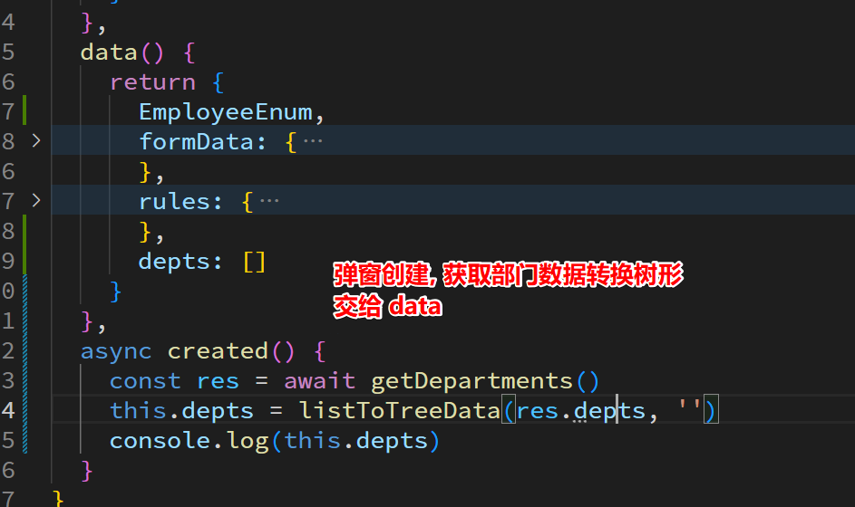

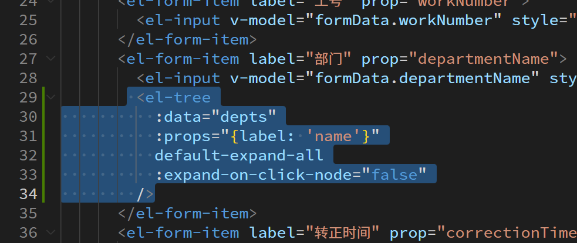

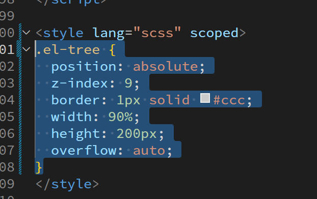

通过变量控制树形是否要显示, 并且在点击部门时, 将部门名称赋值给输入框

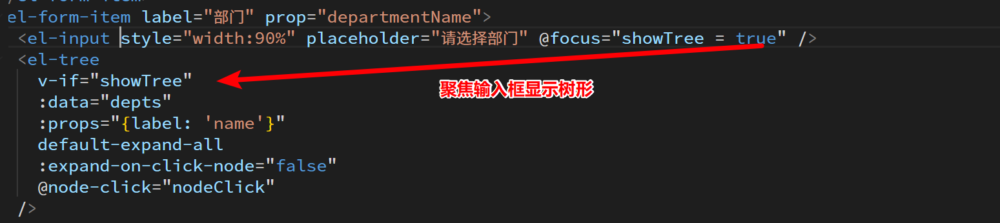

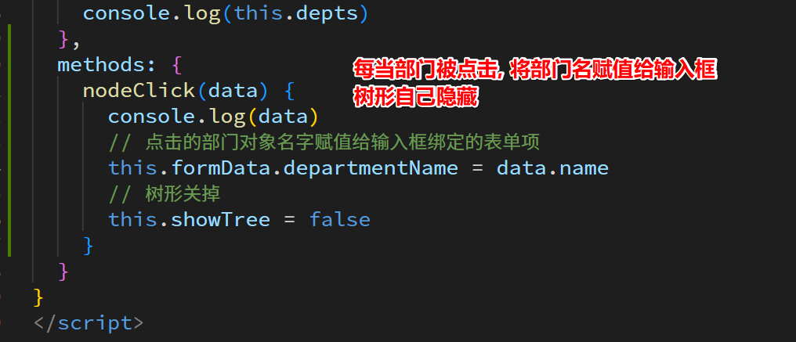

如果不想输入框可以输入, 可以将 v-model 双向绑定变为 :value 的单项数据绑定

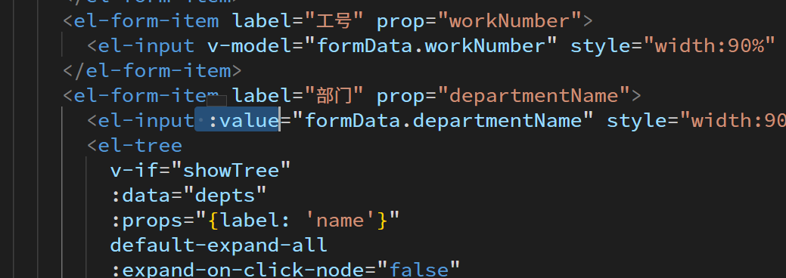

## 完成新增

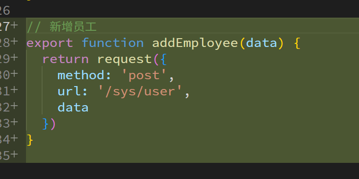

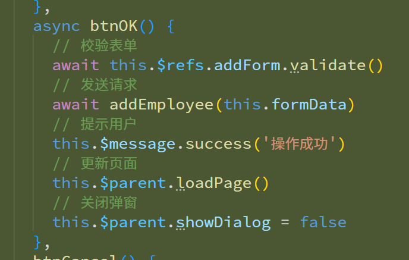

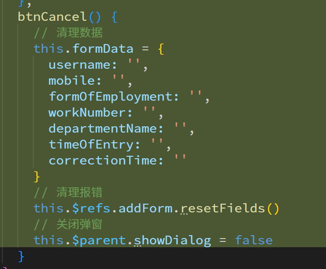

# 删除员工

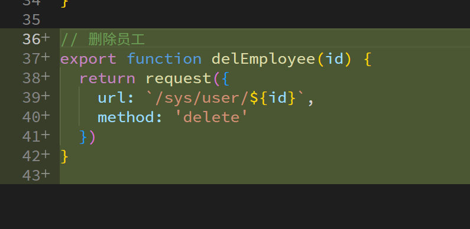

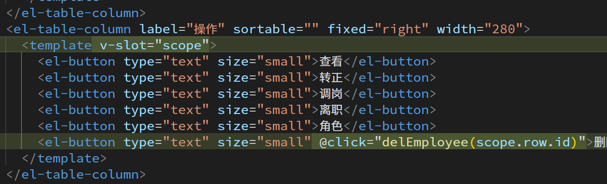

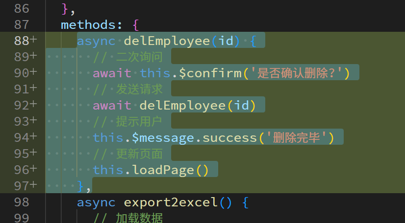

# 编辑员工

## 页面的准备和跳转

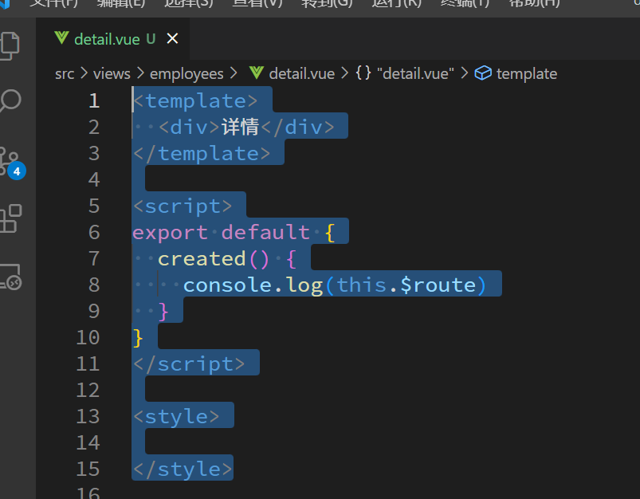

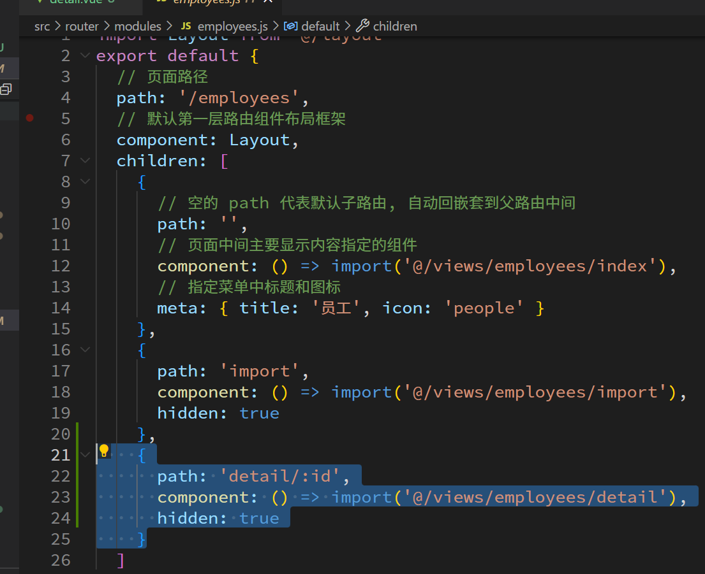

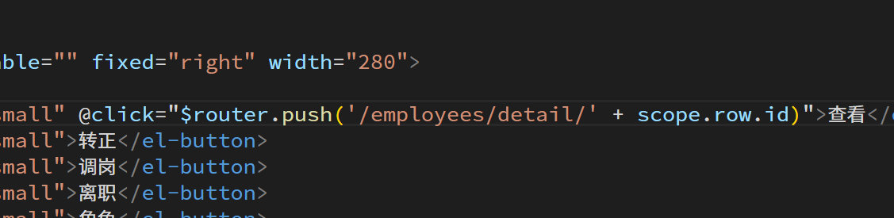
